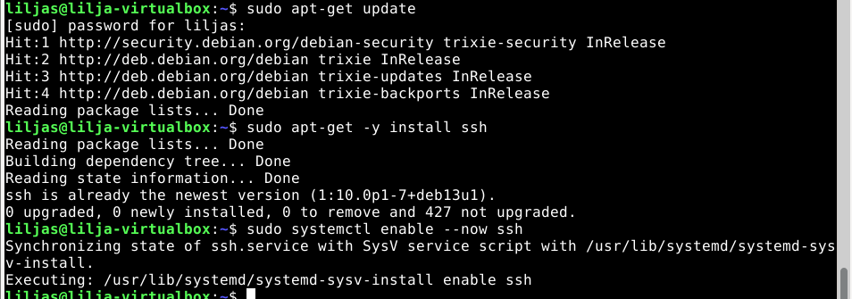
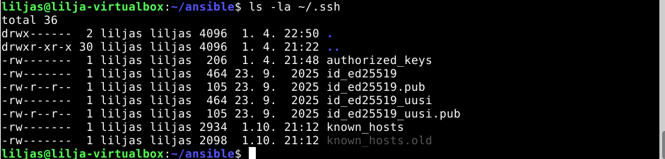
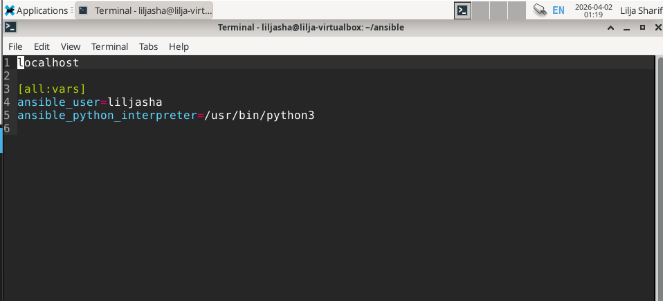
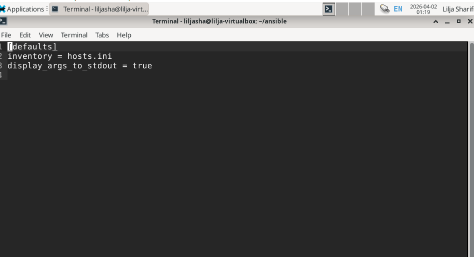
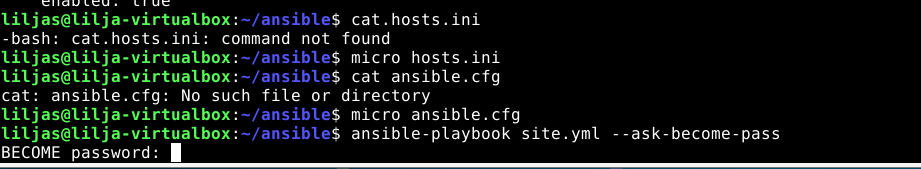
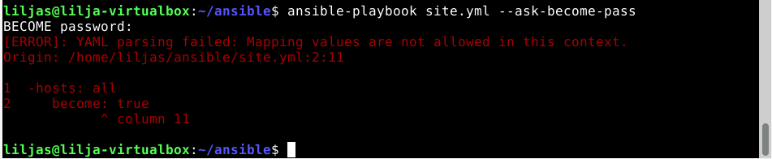
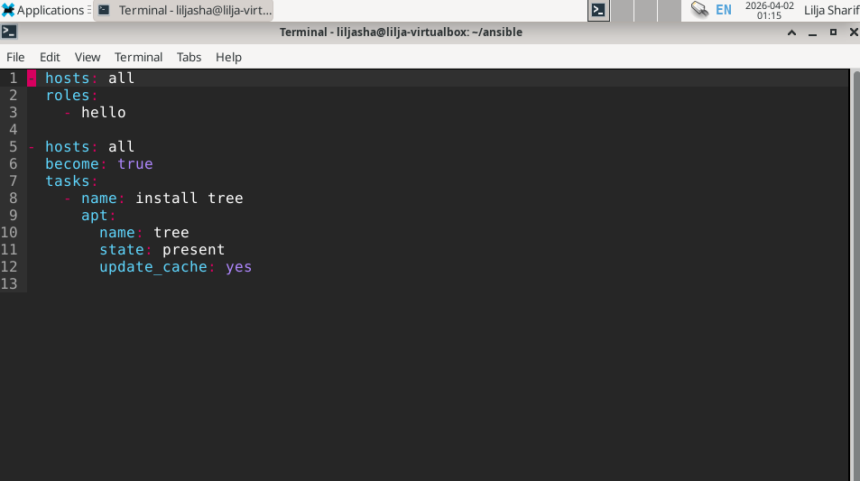
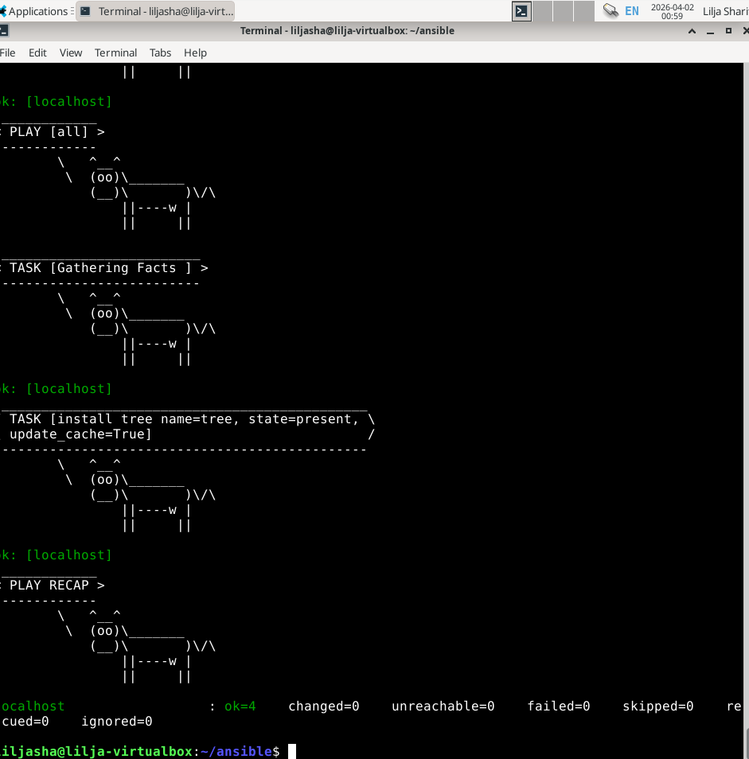

# h1 Hei Ansiblen maailma
 
## Sisältö
* [x) Artikkeli](#x-artikkeli)
* [a) Sshecrets](#a-Sshecrets)
* [b) Pubkey](#b-Pubkey)
* [c) Hei Ansible](#c-Hei-Ansible)
* [d) Vapaaehtoinen bonus](#d-Vapaaehtoinen-bonus)

# x) Artikkeli

## Karvinen 2026: Hello Ansible

- Artikkelissa kerrotaan alkuun perustietoa Ansiblesta. Kyseessä on konfiguraationhallintatyökalu, jolla infrastruktuuria voidaan kirjoittaa koodina (Infrastructure as Code). Käyttäjä määrittelee lopputilan ja Ansible tekee muutoksia vain tarvittaessa.
- Ansible toimii SSH-yhteyden kautta. Orjakoneet tarvitsevat SSH-palvelimen ja Pythonin toimiakseen.
- Oma huomio: Selkeän oloinen työkalu, jota lähden mielenkiinnolla käyttämään jatkossa.

## Karvinen 2026: SSH public key - Login without password

- Artikkelissa kerrotaan SSH-yhteyden julkisesta avaimesta, jolla pääset kirjautumaan ilman salasanaa.
- SSH on yleinen ja turvallinen tapa kirjautua palvelimille.
- Julkinen avain on kätevä, sillä sen avulla salasanaa ei tarvitse lähteä syöttämään uudestaan jokapaikkaan.
- Oma huomio: Tässä on helppo mennä sekaisin, varsinkin jos unohtaa passphrasen, vaikka uuden luominen on onneksi yksinkertaista.

### Koneen tekniset tiedot
* Prosessori: Intel Core i5-8265U CPU @ 1.60 GHz (1.80 GHz turbo, 8 ydintä)
* RAM: 16 GB (15,7 GB käytettävissä)
* Järjestelmä: Windows 11 Pro 64-bittinen (x64-suoritin)
* Näytönohjain: Intel UHD Graphics 620
* Tallennustila: 237 GB, josta 158 GB vapaana
* DirectX-versio: DirectX 12

## a) Sshecrets

Lähdin asentamaan SSH-demonia ohjeistuksen mukaisesti kello 22:00. Ensin suoritin asennuksen ja käynnistyksen, jonka jälkeen testasin SSH-yhteyden localhostiin.

- **`sudo apt-get -y install ssh`**

- **`sudo systemctl enable --now ssh`**

- **`ssh localhost`**

- **`exit`**

_Onnistunut SSH-demonin asentaminen_ 

## b) Pubkey

Etenin seuraavaksi automatisoimaan SSH-kirjautumista julkisella avaimella. Koska avain löytyi jo entuudestaan, etenin alla olevalla tavalla.

 - **`ssh-copy-id localhost`**
 - **`ssh liljasha@localhost`**
 - **`exit`**

Huomasin, että avain oli jo olemassa `authorized_keys` -tiedostossa. Tämän jälkeen pääsin kirjautumaan ilman salasanakyselyjä. Aiemmalla Linux-palvelimet -kurssilla pääsin hyvin jumppaamaan avaimia toistuvilla mokailuilla, joten tämä tuntui yllättävän tutulta ja sujuikin lopulta hyvin, vaikka alkuun oli haasteita hahmottaa tauon jälkeen. 

## c) Hei Ansible. 

Lähdin asentamaan alkuun Ansiblea ja testaamaan SSH-palvelimen toimintaa. Aloitin kuitenkin luomalla kansion konfiguraatiolle etenemällä seuraavasti:

- **`$ cd`**
- **`mkdir ansible/`**
- **`cd ansible/`**

Ohjeistuksen mukaisesti loin hosts.ini tiedoston, johon lisäsin hallittavaksi hostiksi `localhostin`.

- **`micro hosts.ini`**
- **`cat hosts.ini`**
- **`localhost`** - ja tämä teksti ilmenikn tiedoston sisältönä tallentaessa lopuksi.

Tässä kohdin olinkin jo valmiina testaamaan ja Ansiblen toimintaa ajamalla komento:
- **`ansible all -a 'uptime' -i hosts.ini`**

### Python-varoituksen poistaminen

Pythonin valituksen poistaminen käyttökokemuksen parantamiseksi onnistui niin, että syötin komennot yllä mainitut komennot eli **`micro hosts.ini`** ja **`cat hosts.ini`**.

_Sisällöksi ylläoleva_

Testasin komennon uudelleen tämän jälkeen **`ansible all -a 'uptime' -i hosts.ini`** jolloin huomasin mukavasti versiovaroituksen poistuneen ja määritys oli onnistunut.

Lähdin luomaan tiedoston `ansible.cfg` jotta hosts.ini -tiedostoa ei tarvitsisi määrittää uudestaan toistuvasti. Tämä onnistui komennoilla
 
- **`micro ansible.cfg`**
- **`cat ansible.cfg`**

_Sisällöksi_ 

Ansible-komento onnistui nyt ilman - hosts.ini:n määrittelemistä. 

### Ongelmatilanne

Tästä tulikin seuraavaksi virhetilanne, joka ilmeni tiedoston tekstissä olevasta virheestä. Hetki meni jumppailla välilyöntien kanssa, mutta lopulta onnistuin, kun sisennys oli korjattu. 

Lopuksi ajoin vielä uudestaan `ansible-playbook site.yml` joka meni onnistuneesti läpi. Tulosteessa näkyi "Task [Hello : copy]" eli hello-rooli oli oikein tehty. 

## d) Vapaaehtoinen bonus

## Paketin asentaminen

Tässä kohtaa kello olikin jo 0:34 joten päätin edetä helppoa reittiä. Linux-Palvelimet kurssilla olin asentanut paketteja, joten tuntui selkeimmältä valinnalta.

Lähteeksi valikoitui Ansible Communityn (2026) ja Karvisen (2026) ohje. Lisäsin site.yml -tiedostoon alla lisäosuudet sisällön loppuun `tree`-paketin asentamista varten:

Asennus ja määrittely tapahtui suhteellisen nopeasti ja seuraavaksi vielä testaus ajamalla`ansible-playbook site.yml`.

Useamman tunnin uurastelu tuotti tulosta ja alla `tree`-paketin asennus onnistuneesti suoritettuna. Kello oli tässä kohtaa 0:16 joten olin ilahtunut, kun lopputulos päättyi alla olevasti. Kuvaan on päässyt myös aiemman Cowsay-komentoriviohjelman asennuksen mukana tullut lehmäjengi.

# Lähteet

Ansible Community Documentation. 2026. Verkkosivu. _ansible.builtin.package module – Generic OS package manager_. Luettavissa: https://docs.ansible.com/projects/ansible/latest/collections/ansible/builtin/package_module.html Luettu 02.04.2026.

Karvinen, T. 2026. Verkkosivu. _Hello Ansible_. Luettavissa: https://terokarvinen.com/hello-ansible/. Luettu 01.04.2026.

Karvinen, T. 2026. Verkkosivu. _SSH public key - Login without password_. Luettavissa: https://terokarvinen.com/ssh-public-key-login-without-password/. Luettu: 01.04.2026.

Karvinen, T. 2026. Verkkosivu. _Palvelinten hallinta_. Luettavissa: https://terokarvinen.com/palvelinten-hallinta/. Luettu: 01.04.2026.

Sharifi, L. 2025. Verkkosivu. _Maailma kuulee_. Luettavissa: https://github.com/LilJayyy/h4-Maailma-kuulee/blob/main/Palautus.md/. Luettu: 01.04.2026.

