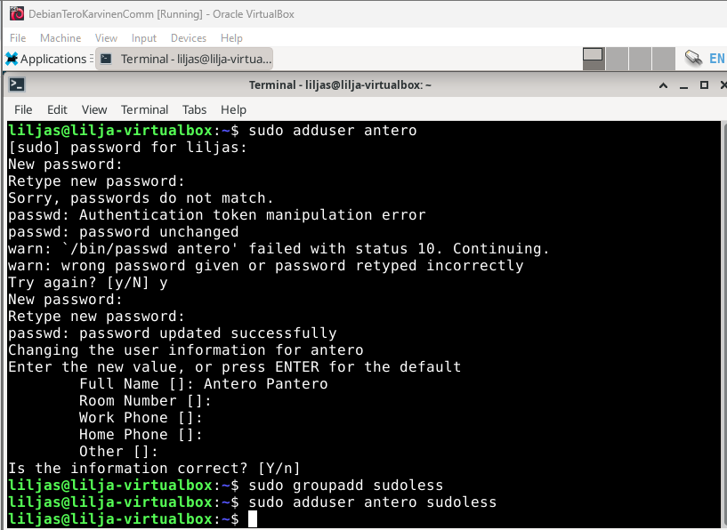
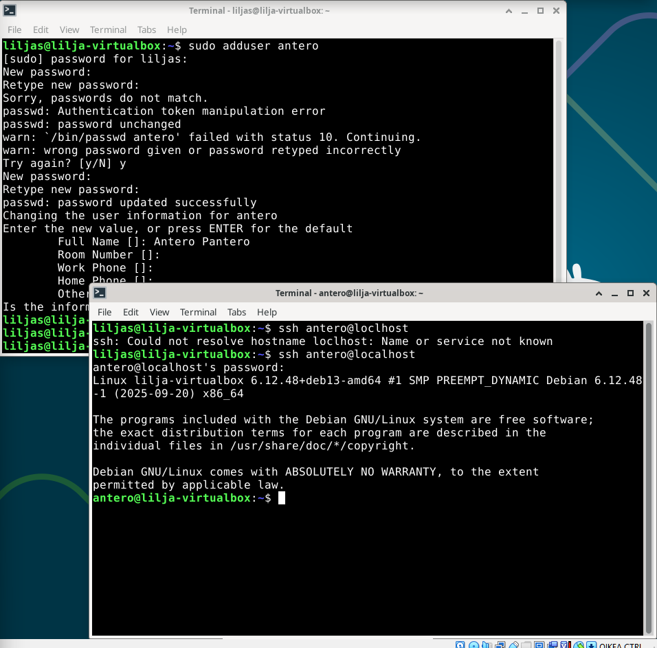
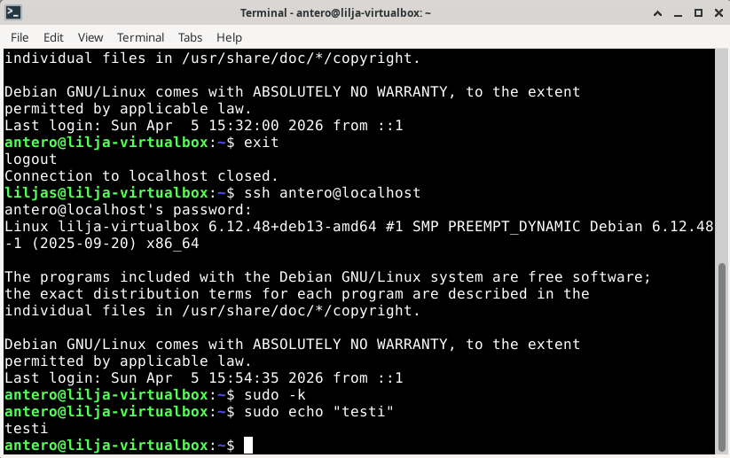
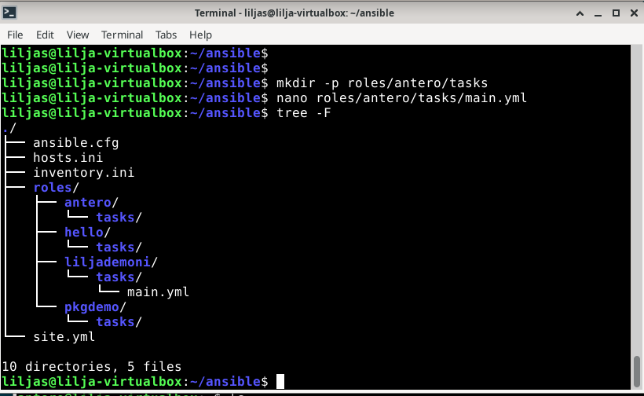
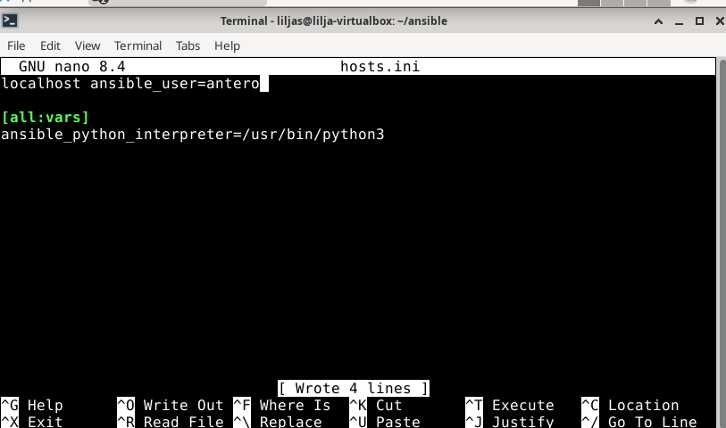
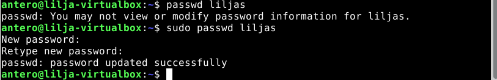
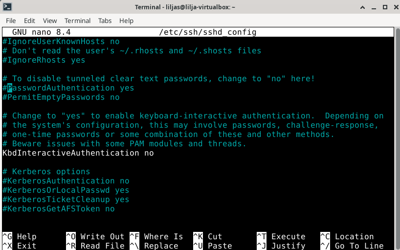
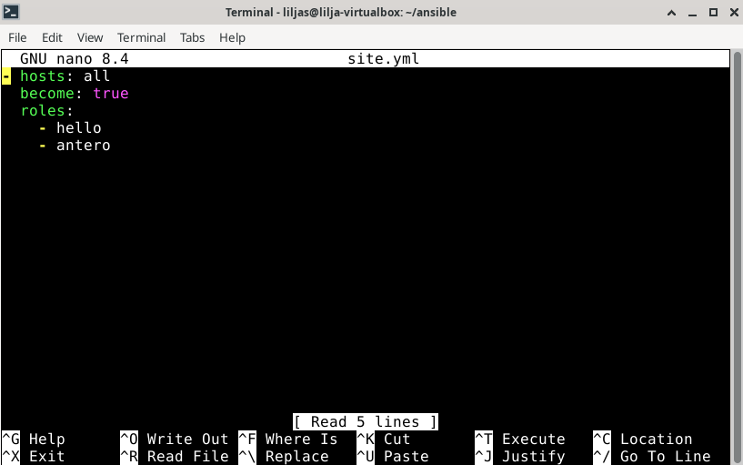
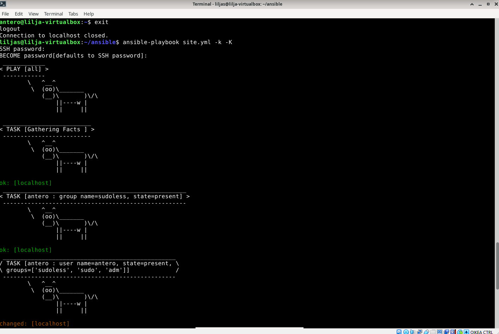

# h2 Voileipä
 
## Sisältö
* [x) Artikkeli](#x-artikkeli)
* [a) Sudoless](#a-sudoless)
* [b) Antero](#b-antero)
* [c) Package](#c-package)
* [d) File](#d-File)
* [e) Jotain muuta](#e-jotain-muuta)


## x) Artikkeli 

## Karvinen 2026: Sudo without password
-Artikkelissa ohjeistetaan sallimaan sudo-komennon käyttäminen ilman salasanaa. 

-Luodaan uusi käyttäjä ja lisätään se "sudoless" -ryhmään hyvällä salasanalla. Muistutetaan hyvien salasanojen käyttämisestä.

-Avataan root-shell vakuutuksena eli turvaksi sen varalta, että sudo menee rikki, jotta sen voi avata shellistä. Tämä tehdään ennen sudoers-tiedoston muokkaamista.

-Syötetään komento`sudo visudo /etc/sudoers.d/sudoless`ja tiedostoon sääntö `%sudoless ALL = (ALL) NOPASSWD: ALL` sallien ryhmälle käytön ilman salasanaa.

Oma huomio: Selkeä ohje, jossa tulee kuitenkin olla tarkkana, jotta prosessia ei tarvitse monesti toistaa.

## Munroe 2006: xkcd 149: Sandwitch
-Sarjakuvassa on hauskasti kuvailtu miten sudo-komento toimii. On pakko totella ja tehdä se voileipä!

-Sudolla toimitaan pääkäyttäjän oikeuksilla (root) eikä userin, eli tavallisen käyttäjän oikeuksilla.

-Siinä on kuvailtu kuvituksen muodossa, millainen merkitys komennolla on. Sudolla "pakotetaan" suorittamaan tiettyjä komentoja ja on äärimmäisen tärkeä ellei yksi tärkeimmistä komennoista muistaa.

Oma huomio: Miksi juuri voileipä? 

## Karvinen 2026: Passwordless with Ansible
-Ansiblessa rooli (role) on luoda "sudoless" ryhmä. Lisää säännön `sudoers.d/ NOPASSWD` ryhmälle.

-Teron sääntö numero 1: Manuaalinen ennen automaattista. Tällä tarkoitetaan sitä, että tehdään ensin salasanaton sudo manuaalisesti ensin.

-`Tree-komennolla` hakemiston rakenne tarkistetaan ja `cat`- komennolla tiedoston sisältö.

-Alkuun ei ole sudoa ilman salasanaa, joten sitä työstetään ensin. Pitää ensin lisätä `become: true`oikeaan kohtaan blockissa site.yml:ssä. lopuksi `playbook` ajetaan ja tarvittaessa sudo annetaan -K lisäyksellä.

Kysymys: Kumpi tuli ensin, muna vai kana?

## Ansiblen sisäänrakennettu dokumentaatio ansible-doc -kommennolla
Ansiblen sisäänrakennettu dokumentaatio ansible-doc -kommennolla.
Kustakin vain
Johdantokappale (Usein MODULE alla, päättyy OPTIONS alkuun)
Nimetyt optiot selityksineen
Esimerkeistä (EXAMPLES) jokin helppo ja keskeinen esimerkki
'ansible-doc copy': content, dest, src; owner, group, mode;
'ansible-doc apt': name, state, update_cache.
'ansible-doc file': path, recurse, src, state. owner, group, mode;
'ansible-doc user': name; create_home, comment, groups, shell, state, system.
'ansible-doc authorized_key': user, key.


### Koneen tekniset tiedot
* Prosessori: Intel Core i5-8265U CPU @ 1.60 GHz (1.80 GHz turbo, 8 ydintä)
* RAM: 16 GB (15,7 GB käytettävissä)
* Järjestelmä: Windows 11 Pro 64-bittinen (x64-suoritin)
* Näytönohjain: Intel UHD Graphics 620
* Tallennustila: 237 GB, josta 158 GB vapaana
* DirectX-versio: DirectX 12


## a) Sudoless

Lähdin 15.35 aloittelemaan raportin tekoa. Käynnistin virtuaalikoneen ja lähdin luomaan uutta käyttäjää. Pitäydyin ohjeistuksen mukaisessa `antero` userissa.

Suoritin seuraavat komennot uuden käyttäjän luomista varten:

* **`sudo adduser antero`**
* **`sudo groupadd sudoless`**
* **`sudo adduser antero sudoless`**



_Käyttäjän luomien_ 

Käynnistin uuden ikkunan terminaalissa ja otin ssh-yhteyden kohdekoneeseen.

_
_Onnistunut yhteyden muodostaminen_

Avasin uuteen ikkunaan root-shellin sudolla varmuuden vuoksi, jos sudoers-tiedosto menee rikki.

Palasin takaisin toiseen ikkunaan jossa olen kirjautuneena pääkäyttäjän roolissa. 

Lähdin seuraavaksi luomaan sudoers -tiedostoon sääntöä alla olevin komennoin:

* **`sudo visudo /etc/sudoers.d/sudoless`**
* **`%sudoless ALL = (ALL) NOPASSWD: ALL`**

Lopuksi vielä `ctrl+ s` ja `ctrl + x` jolla tallensin muutokset

Testasin toisella ikkunalla jossa ssh- yhteys oli päällä kirjautua ulos `exit` ja perään uudelleenkirjautuminen ssh-yhteydellä `ssh antero@localhost`

Tässä kohtaa hetken mietin, olinko tehnyt väärin, kun ssh-yhteys kysyi salasanaa. Hetken mietinnän jälkeen tajusin, että en ole vielä ehtinyt tuohon kohtaan saakka ja testiosuus jäi väliin. Eli yritin uudestaan:

* **`sudo -k`**
* **`sudo echo testi`**

Syötteeksi tuli testi ilman salasanakyselyjä, joten tehtävä oli suoritettu onnistuneesti.


_

_sudo echo komennon vastaus_


## b) Antero

Siirryin tähän tehtäväosioon 16:30 pienen tauon jälkeen.

Tässä kohtaa jouduin hieman palailemaan omaan h1 tehtävääni (2026) ja Command Line Basics Revisited (2020) sillä en muistanut ulkkoa miten pääsen tarkastelemaan `tree` rakennetta.

Tässä suoritetut komennot, jolla siirryin `ansible`-hakemistoon:

* **`cd ansible`**
* **`ls`**
* **`tree -F`**

Eli `cd ansible` suoritettiin jotta päästiin ansible hakemistoon, rakenteen tarkistus `ls`ja `tree -F`komennolla.

_

_antero rooli lisätty_ 

Hetken pohdinnan jälkeen hahmottui, että täytyi luoda tiedosto alla olevilla komennoilla ja lopuksi vielä sisältö: 

* **`mkdir -p roles/antero/tasks`**
* **`nano roles/antero/tasks/main.yml`**

```
- group:
    name: "sudoless"
    state: present
- user:
    name: "antero"
    state: present
    groups: ["sudoless", "sudo", "adm"]
- authorized_key:
    user: "antero"
    key: "ssh-ed25519 U2VlIHlvdSBhdCBUZXJvS2FydmluZW4uY29tIQ== tero@example.com"
- copy:
    dest: "/etc/sudoers.d/sudoless"
    content: "%sudoless ALL = (ALL) NOPASSWD: ALL\n"
    owner: "root"
    group: "root"
    mode: "0644"
 ```

Tässä kohtaa tulikin jälleen pieni ongelmatilanne. En päässyt etenemään `site.yml` tiedoston muokkaamiseen, sillä ´hosts.ini`-tiedostossa oli vanhemmat tiedot, jossa se yritti kirjautua liljasha@localhost`-ina, jolla olin testaillut aiemmin. Pieni paluu h1 tehtävän raporttiin onneksi auttoi ja löysin syyn. Kävin `hosts.ini` -tiedostoon päivittämässä alla olevasti ansible_user kohtaan `antero ja pyyhin aiemman.


_

_useriksi antero kirjautumista varten_

Seuraavaksi SSH-avain jota valitteli ohjeistuksen varoituksen mukaisesti. Syötin komennon:

* **`ansible-playbook site.yml --ask-become-password`**

Pieni ongelma tuli jälleen vastaan. Jostain syystä liljas -salasana ei kirjautunutkaan enää, kun yritin `sudo nano /etc/ssh/sshd_config`  -komennolla tarkistaa salasanakirjautumisen tilanteen. Onneksi pääsin muuttamaan sen anteron kautta sudolla alla olevasti:

_

_Salasananvaihtoa välissä sudolla_

Pääsipähän tuotakin jumppaamaan eri tavalla, kun root-shell ei ollutkaan auki, kuten piti.

Nyt pääsin muokkaamaan mielestäni jo aiemmin muutetua, mutta teinpäs sen uudelleen:

* **`sudo nano /etc/ssh/sshd_config`**
* Otetaan "#" -merkki pois "PasswordAuthentication" edestä
* **`ctrl + s ja ctrl x`**

  _
  
_Käyttöönotto ottamalla # merkki pois_

Lopuksi vielä ssh:n uudelleenkäynnistystä komennolla:
* **`sudo systemctl restart ssh`**

Olin vielä aiemmin testailujeni aikana tehnyt toisen roolin, mutta unohtanut anteron sieltä eli pääsin lisäämään sen seuraavin askelin:

* **`cat site.yml`** - tällä havaitsin että antero rooli puuttuu
* **`nano site.yml`** lisäsin roolin `antero` ja lopuksi vielä tallennus


  _

  _antero roolin lisääminen_


Takaisin isäntäkone (host) näkymään ja suoritin jälleen komennon: 
* **`ansible-playbook --help`** dokumentaatioon sillä minulla `ansible-playbook site.yml --ask-become-password` ei toiminut. Help-komento tullut muutamilla kursseilla vastaan ja toimi tässä hyvin apuna, vaikka hetki meni hahmottaa, mikä on ongelma ja ratkaisu.
* **sieltä nappasin kohdan -k ja -K`**
* **`ansible-playbook site.yml -k -K`** lopulta oikeaksi komennoksi jolla pääsin miellyttävään lopputulemaan: Tehtävä oli onnistunut.

  

  _Ansiblella onnistuneesti luotu antero-rooli_ 

## c) Package


## d) File


## e) Jotain muuta


# LÄHTEET 


Sharifi, L. 2026. Verkkosivu. _h1 Hei Ansiblen maailma_. Luettavissa: https://github.com/LilJayyy/Palvelinten-hallinta/blob/main/h1.md/ Luettu: xx.04.2026

Karvinen, T. 2026. Verkkosivu. _Sudo without password_ Luettavissa: https://terokarvinen.com/passwordless-sudo/ Luettu xx.04.2026.

Karvinen, T. 2026. Verkkosivu. _Passwordless Sudo with Ansible_ Luettavissa: https://terokarvinen.com/passwordless-sudo-with-ansible/ Luettu xx.04.2026.

Karvinen, T. 2020. Verkkosivu. _Command Line Basics Revisited_ Luettavissa: https://terokarvinen.com/2020/command-line-basics-revisited/ Luettu: xx.04.2026.

Munroe. 2006. Verkkosivu. _xkcd 149: Sandwitch_ Luettavissa: https://xkcd.com/149/ Luettu: xx.04.2026.

