# h3 Demoni
 
# Sisältö
* [x) Artikkeli](#x-artikkeli)
* [a) Apassi](#a-apassi)
* [b) Moottorix](#b-moottorix)
* [c) Automoottorix](#c-automoottorix)
* [d) Vapaaehtoinen bonus](#d-vapaaehtoinen-bonus)

### Koneen tekniset tiedot
* Prosessori: Intel Core i5-8265U CPU @ 1.60 GHz (1.80 GHz turbo, 8 ydintä)
* RAM: 16 GB (15,7 GB käytettävissä)
* Järjestelmä: Windows 11 Pro 64-bittinen (x64-suoritin)
* Näytönohjain: Intel UHD Graphics 620
* Tallennustila: 237 GB, josta 158 GB vapaana
* DirectX-versio: DirectX 12

## x) Artikkeli

### Karvinen 2026: Apache installed with Ansible - quick notes
- Ohjeistetaan miten asennetaan Ansiblella Apache2 Web Server automaattisesti.
  
- Siinä kerrotaan, että demonit ovat jokseenkin samanlaisia. Sama asia toistuu. Asenna demoni, muuta konfiguraatiot muokkaamalla tiedostoja, ja käynnistä.
 
- Demonia pitää aina muistaa potkaista, jotta konfiguraatiotiedostot lähtevät käyntiin. Eritoten huomioiden file tasks/main.yml:ssä.

Kysymys & vitsi: Miksi demonia pitää potkaista? - Demoni vastasi: Konfiguraatiotiedostoja luen vain käynnistyessäni! Heh heh! Miten voisin muuten huomata muutoksen?

### Ansible Community Documentation Handlers: running operations on change

#### a) Handlers: running operations on change
- Siinä kerrotaan, että tehtävä voidaan haluta ajettavaksi vain silloin, kun muutos on tehty koneessa.
  
- Kerrotaan, että Ansible käyttää handlerseja suorittaakseen tämän tyyppisiä toimenpiteitä. Handlersit ovat siis eräänlaisia tehtäviä, jotka ajetaan vain silloin, kun pyydetään.

Huomio: Tätä oli edelleen hieman vaikea hahmottaa, mutta ainakin hyödynsi, kun ei käynnistynyt Nginx turhaan vaan ainoastaan konfiguraation muuttuessa.
 
**Notifying handlers** 
- Notify-sanaa käytetään, jos halutaan yhdelle tai useammalle ajaa tehtävä.
  
- Notify-sanaa voi käyttää ja laittaa listaan, jossa hyväksytään tiettyjä handler -nimiä, joille ilmoitetaan muutoksen tullessa.

Kysymys: Mikä on raja, kuinka monta sanaa voi käyttää ja laittaa listaan? Vastaus: Mitään rajaa ei ole!

#### b) 'ansible-doc service':
-johdantokappale:
- Hallitsee palveluita etäkoneilla. 
- Tämä moduuli on välittäjä monelle spesifimmälle palvelunhallintamoduulille moduulille

-enabled:
- Määrittää palvelun käynnistymisen koneen käynnistyessä
- Vähintään yksi `state` ja `enabled` on vaadittu.

-name: 
- Palvelun nimi
- Tyyppi: str

-state: 
- `started` ja `stopped` ovat idempotentteja, eli toiminto voidaan suorittaa monta kertaa samalla lopputulemalla.
- `reloaded` käynnistää palvelun jos se ei ole jo valmiiksi käynnistetty, vaikka valittu init-järjestelmä ei tekisi niin.

-EXAMPLES:
* name: aloita palvelu httpd, jos ei ole käynnistetty
* name: pysäytä palvelu httpd jos käynnistetty

Huomio: Auttoi ymmärtämään käytännössä service-moduulin käytössä. Opittavaa toki vielä on ja paljon.

## a) Apassi 

Lähdin tekemään raporttia 11.4.2026 kello 18:21. Aloitetaan asentamalla Apache2 käsin, eli ei Ansibleen - jonne erheellisesti ensin lähdin eksymään.

Ohjeistuksena oli, että Weppisivun tulee näkyä palvelimen etusivulla ja että sivun tulee olla tavallisen käyttäjän muokattavissa ilman root- tai sudo-oikeuksia.

Tässä tehtäväosiossa käytin apuna Karvisen (2026) Apache installed with Ansible - quick notes -ohjetta.

#### Siirryin ensin:

* **`ls -la`** - tarkastelin kaikkia tietoja ja oikeuksia
  
* **`sudo apt-get update`** - päivitetään paketit
  
* **`sudo apt-get install apache2`** - asensin varuiksi apache2 - tuli virheilmoitus: "apache2 is already the newest version (2.4.66-1~deb13u2)." Eli oli asennettu jo.

Tässä kohtaa tein välillä paluuta edeltävään raporttiini h2 Voileipä (Sharifi, 2026), jotta sain muisteltua etenemisaskeleet.

Koska olin jo asentanut manuaalisesti aiemmin apache2:n ja weppisivun, niin lähden kertauksen vuoksi tarkistelemaan tiedostojen sisältöjä ja muokkaamaan niitä tarvittaessa. 

### Tarkistetaan tietojen ja tiedostojen sisällöt

* Avasin selaimen ja menin Apachen sivustolle `http://localhost` -sivusto näkyi eli se toimi.

_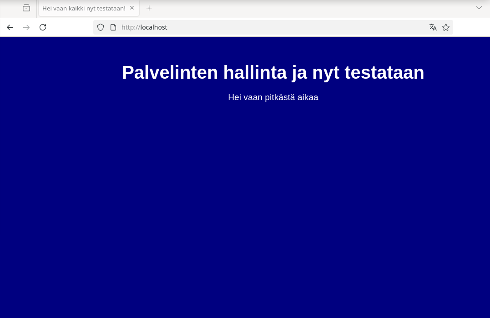

_Apache pyörii - localhost toimii_
  
### Oikeudet 

Lähdin tarkistamaan oikeuksia, eli tehtävänantona oli, että tavallinen käyttäjä pääsee muokkaamaan sivua ilman sudoa.
  
Tehtävän ohjeistuksessa olikin Vinkit -osiossa tähän vihje. 

**Tässä oli tärkeää hahmottaa, että uusi tiedosto tehdään kotihakemistossa, ei ansible-hakemistossa.**

Lähdin tarkistamaan tiedostoa 000-default.conf jotta voin tarkistaa, olinko luennon aikana onnistunut muuttamaan asetuksia niin, että tavallinen käyttäjä voi tehdä muutoksen. 

Tässä oli tärkeää, että ei käyttänyt chmod + numeroita Teron ohjeen mukaan, mikäli sitä tulisikin muuttaa.

Yritin tässä tehtävänannossa kovin itse muistella komentoja ja ymmärtää, mitä teen, joten tässä tehtävässä olikin tarkoitus viettää enemmän aikaa.

* **`ls /etc/`** - täältä etsin apache2 -kansion

* **`ls /etc/apache2/`** Apache kansio
 
* **`ls /etc/apache2/sites-enabled/`** - katsoin sites-enabled hakemiston sisällön
 
* **`cat /etc/apache2/sites-enabled/000-default.conf`** - katsoin tiedoston sisällön - tässä kohtaa ei näe vielä omistajatietoja - löysin tässä tiedon, että DocumentRoot on /var/www/html/ josta pitää tarkistaa oikeudet.
 
* **`ls -la /var/www/html/`** - tarkistetaan oikeudet

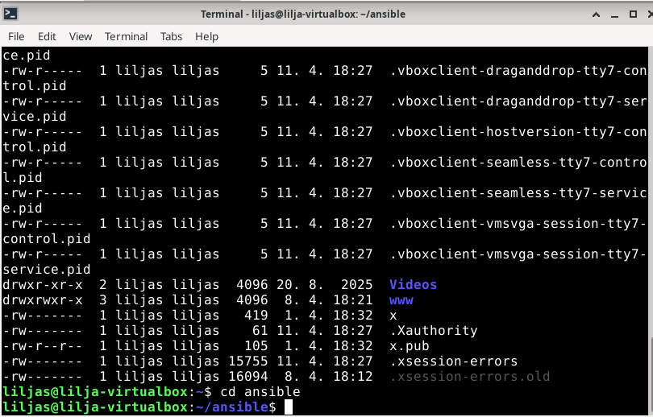

_DocumentRoot /var/www/html/ oikeudet_

Yllä olevan kuvan mukaisesti käyttäjällä `liljas` eli tavallisella käyttäjällä oli oikeudet muokata tiedostoja. 

Sivu näkyi localhostissa ja minä (liljas) omistin tiedostot. 

Lähdin seuraavaksi etenemään testaamisen merkeissä.

### Testaaminen

Tarkoitukseni oli muokata nyt index.html -tiedostoa ilman sudoa, jotta voidaan testata onko tosiaan tavallisella käyttäjällä oikeudet.

**Tässä kohtaa oli tärkeää ymmärtää, että alla olevassa kuvassa on Apache-konfiguraatiotiedosto – ei index.html-tiedosto.** 

Aloittelijana tässäkin kohtaa sai hetken tuijotella.

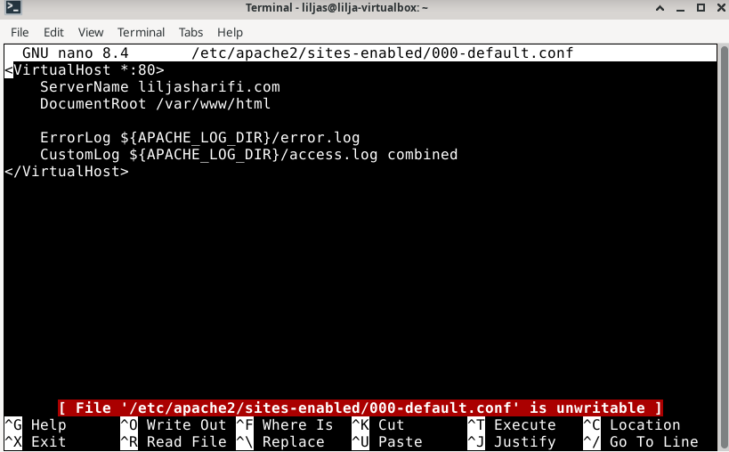

_Apache konfiguraatiotiedosto_

Tarkoitus on päästä `index.html` -tiedostoon muokkaamaan tietoja.

Konfiguraatiotiedostosta selvisi, että `DocumentRoot` on `/var/www/html/`, jonne pitää navigoida.

### Sivuston muokkaamiseen etenin seuraavin komennoin:

* **`micro /var/www/html/index.html`**

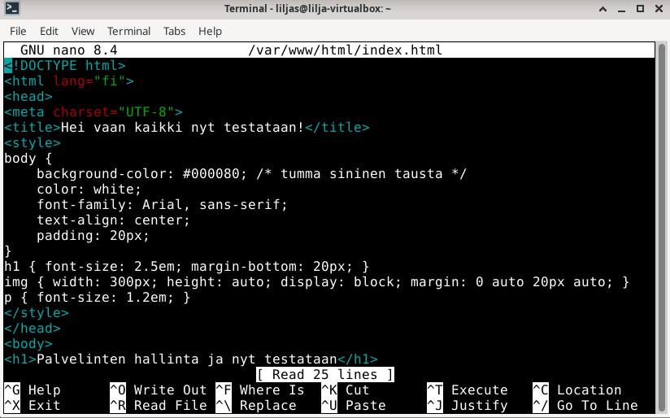

Vihdoin pääsin muokkaamaan sivun sisältöä, eli testaamaan, onko oikeudet tavallisella käyttäjällä.

Kävin poistamassa epämääräiset värit sivuilta testiksi.

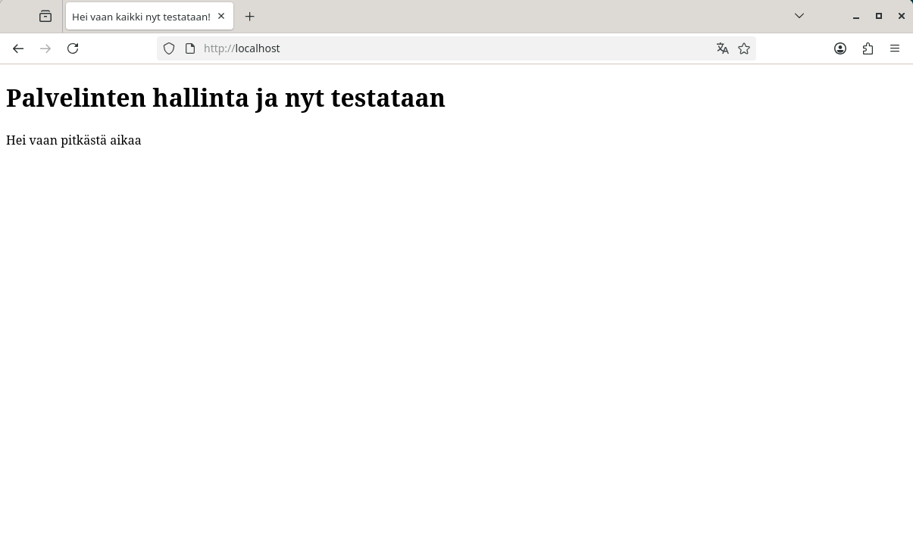

_Apachen sivusto päivitetty_

Ja kuten yllä näkyy - muokkaus onnistui ongelmitta.

Mikäli tässä kohtaa olisi ilmennyt ongelma, olisi tullut edetä komennoin:

### Omistajuuden vaihtaminen

* **`chown`** = changing owner

* **`chown -R liljas /var/www/html/`**  - liljas kohtaan oma käyttäjänimesi ja DocumentRoot.

## b) Moottorix

Lähdin tähän osioon 21.02 samana iltana tauon jälkeen. 

Aloitin asentamalla Nginx:n jonka muistelin kuitenkin asentaneeni jo luennon aikana. 

Nginx täytyi asentaa käsin ja Weppisivun tuli näkyä palvelimen etusivulla.

### Asennettiin Nginx

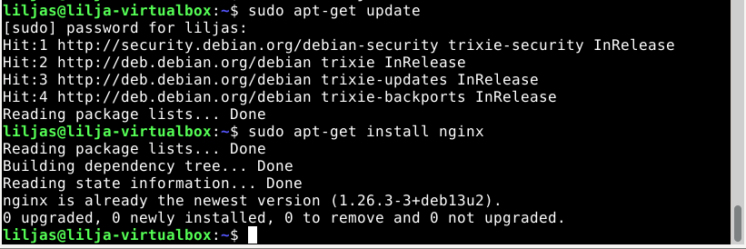

_Nginx olikin jo asennettu_

Sama ohjeistus tässä kuten Apachella, eli tuli olla tavallisen käyttäjän muokattavissa sivut ilman root -tai sudo-oikeuksia. 

**Oli tärkeää muistaa sammuttaa Apache käsin.**

Olisin tässä käyttänyt Karvisen (2008) Apachen asennus ohjetta, mutta sivustoa ei saanut auki. 

Lehdon (2022) ohjeen löysin kuitenkin, jota myös käytimme Linux-palvelimet kurssilla ohjeena.

Löysin onnekseni myös luennolla kirjoittamani muistiinpanot, jolla lopulta etenin.

### Stopattiin Apache 

* **`sudo apt-get update`** - päivitin paketit

* **`sudo systemctl stop apache2`** - stoppasin Apachen

* **`curl localhost`** - tarkistin tilanteen

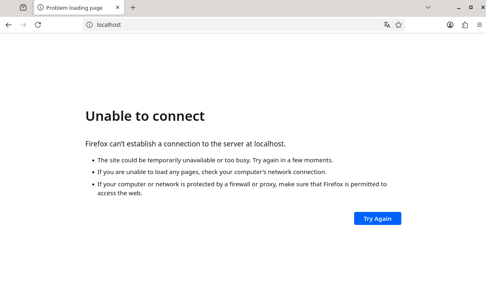

_Kuvan mukaisesti onnistunut Apachen stoppaus_

### Potkaistiin Nginx 

* **`sudo apt-get update`** - päivitin paketit tähän väliin

* **`sudo systemctl restart nginx`** - potkaistaan Nginx päälle

### Tarkistaminen - menikö Nginx päälle

Kuvan mukaisesti Nginx potkaistiin onnistuneesti käyntiin.

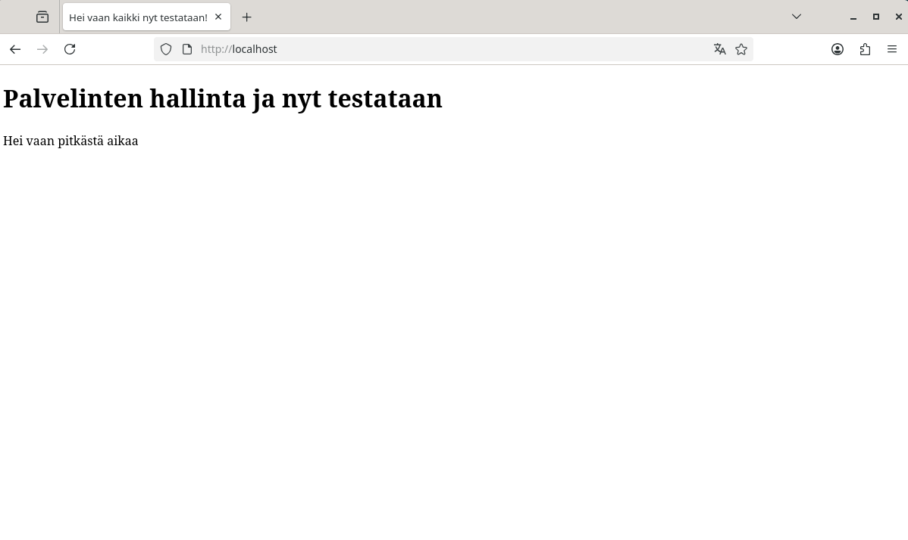

_Nginx käynnistyi ja sivu nousi pystyyn_

### Oikeuksien muokkaaminen tavalliselle käyttäjälle

Lähdin selvittämään alkuun DocumentRootin. 

Tässä kohtaa etenin hyvin pitkälti samalla tavalla, kuin Apachen kanssa:

* **`ls -la /etc/nginx/`** - Etsitään Nginxin konfiguraatiotiedosto josta etsitään DocumentRoot

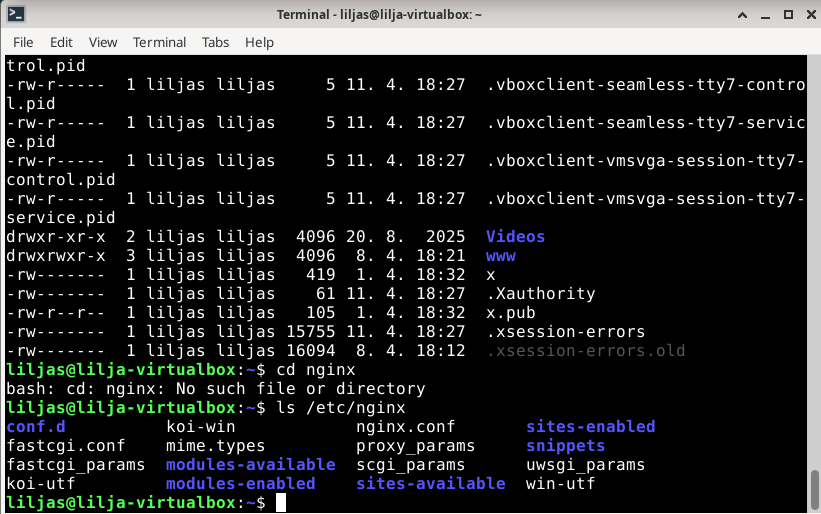

_Nginx konfiguraatiotiedoston etsimistä_

#### Virhetilanne 

Tässä kohtaa kävi klassinen virhe eli etsin väärällä komennolla `cat` eikä oikealla `ls`. 

`cat` - on tarkoitettu tiedoston sisällä olevan tiedon näyttämiseen

`ls` - on tarkoitettu hakemiston sisällä olevan tiedon näyttämiseen.

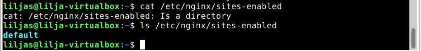

_Etsimisen sekoilua_

Sisältä löytyi default - tiedosto. Lähdin availemaan sitä, jotta näen DocumentRootin.

* **`cat /etc/nginx/sites-enabled/default`** - katsoin tiedoston sisälle
  
Löytyi mitä tarvitsin eli ` /var/www/html/` on Nginxin DocumentRoot.

Tässä pääsin onneksi hieman sekoilemaan myös kun koitin muistella komentoa.

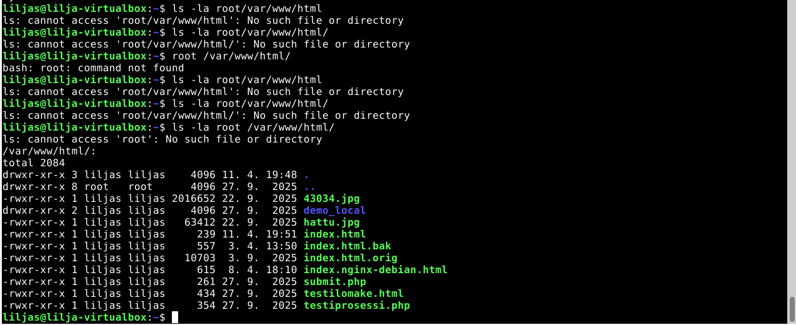

_komentojen sekoilu ja itse oikeudet_

* **`ls -la /var/www/html/`** - tällä oikealla hakukomennolla ja DocumentRootilla päästiin oikeuksia tarkistelemaan.

Olin luennon aikana kerennyt muokkaamaan tähänkin jo oikeudet ilman sudoa. 

### Testaaminen Nginx ilman sudoa ja oikeuksien tarkistus

Lähdin testaamaan kuten Apachellakin, että voin tosiaan muokata ilman sudoa.

* **`micro /var/www/html/index.html`** - microlla muokkaamaan tiedostoa eli sivun sisältöä
 
* **`ctrl + s` ja `ctrl + Q`** - tallennetaan muutokset

Muokkasin sisältöön: `"Hei vaan hei"` aiemman `"Hei vaan pitkästä aikaa!"` - tekstin tilalle.

Sitten sivuston päivitystä ja alla olevan kuvan mukaisesti pääsin onnistuneesti muokkaamaan tiedostoa ilman sudoa.

_Uusi teksti oli päivittynyt sivustolle_

`-rwxr-xr-x 1 liljas liljas 239 11. 4. 19:51 index.html` - tämä kertoo, että käyttäjällä `liljas` on oikeudet index.html tiedostoon.

Tämä tehtäväosio oli onnistunut ja pääsinkin jo ennen kello 22 etenemään seuraavaan.

## c) Automoottorix

Tässä tehtävänosiossa oli tarkoituksena automatisoida Nginx asennus Ansiblella, jossa riitti vain ylläpitäjän osuus ja HTML-weppisivut pystyi tehdä käsin.

Lähdin tekemään tarkistusta seuraavasti:

* **`cd ansible`** - Ansiblen hakemistoon
* **`ls -la`** - tarkistin tiedostot
* **`cat site.yml`** - tarkistin roolit hakemistosta, löytyykö Nginx sieltä jo entuudestaan

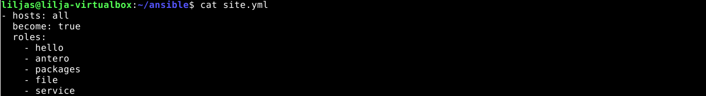

_Nginx roolia ei löytynyt_ 

Nginx rooli ei löytynyt `roles`-hakemistosta, joten lähdin luomaan sen.

Käytin tässä apuna omaa h2 Voileipä -raporttiani (Sharifi, 2026).

### Nginx roolin luominen

* **`mkdir -p roles/nginx/tasks/`**  - luodaan rooli

### Nginx roolille sisällön luominen
  
* **`micro roles/nginx/tasks/main.yml`** - luodaan sisältö

**Tässä kohtaa minun piti hieman miettiä, mitä laitan `main.yml` sisältöön. Karvisen (2026) ohjeissa onneksi oli esimerkki sisällöstä.**

Muokkasin `Nginx` -tietojen mukaisesti muuttaen kuitenkin `hakemistot` ja `tiedostojen nimet`, mutta muutoin sama sisältö.

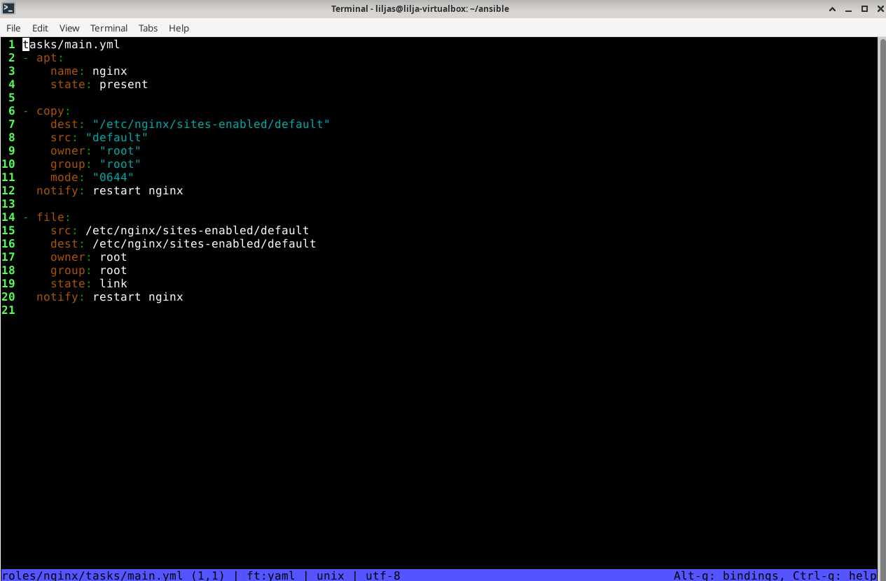

_main.yml sisältö jonka muokkasin_ 

Lopuksi vielä `ctrl + s` ja `ctrl + Q` jolla tallensin muutokset.

* **`micro site.yml`** - lähdin lisäämään roolin site.yml listalle ja tallennus

 ### Tarkistaminen

* **`cat site.yml`** - tarkistin että rooli oli onnistuneesti lisätty listalle

* **`ansible-playbook site.yml -k -K`** - ajetaan playbook

### Virhetilanne: YAML-tiedostossa muotoiluvirhe

Alla olevan kuvan mukaisesti tuli virheilmoitus.

YAML-tiedostossa oli muotoiluvirhe. Tätä pääsikin seurailemaan luennolla ja hieman kauhistelemaan, sillä koen, että YAML-tiedoston sisältöä on vielä itse hieman hankala hahmottaa.

Onneksi on Karvisen (2026) esimerkki, jota on voinut seurata.

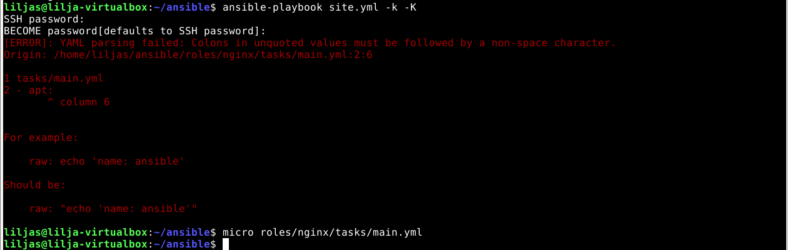

_Virhe muotoilussa herja_

* **`micro roles/nginx/tasks/main.yml`** - avataan YAML-tiedosto

Siellä se virhe olikin. Rivillä 1 oli turhaa tekstiä, jonka kumitin pois. 

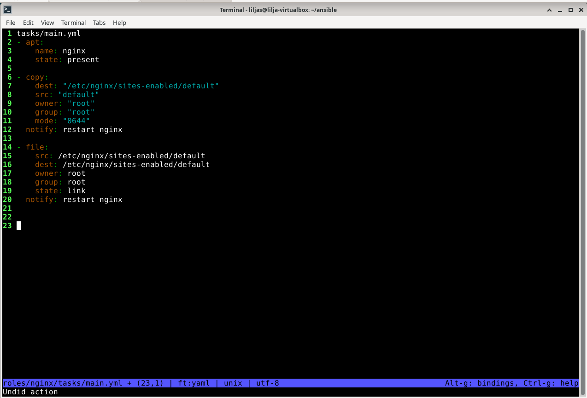

_Sisällön virhe rivillä 1_

Tallennus ja uusi Ansiblen potkaisu. 

* **`ansible-playbook site.yml -k -K`** 

### Virhetilanne: Files tiedostoa ei löydy

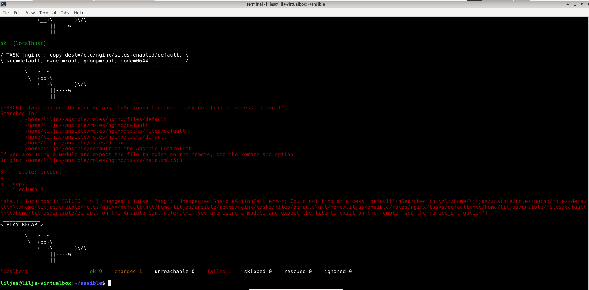

_Ei löydä files tiedostoa_

Tässä virheilmoitus kertoi onnekseni selvästi, että se ei löytänyt tai päässyt tiedostoon `default`. Lähdin luomaan sitä.

### default tiedoston luominen

* **`mkdir roles/nginx/files/`** - luotiin files -tiedosto

Meinasin tässä kohtaa koko ajan laittaa `roles` eteen `/` -merkin. Koska olin jo `ansible` -hakemistossa, ei kauttaviivaa sen eteen tarvittu.

#### Nginx konfiguraatiotiedoston sisällön laittaminen files -tiedostoon

Nyt olin luonut files -tiedoston. Sen sisälle tulee laittaa Nginx konfiguraatiotiedoston sisältö. 

Tässä käytin apuna `cp` -komentoa.

Sillä voidaan kätevästi siirtää lähdepolusta kohdepolkuun tietoa. Tämä oli erittäin hyödyllinen oppi.

* **`cp /etc/nginx/sites-enabled/default roles/nginx/files/`**

Oli aika lähteä potkaisemaan Ansiblea uudestaan.

* **`ansible-playbook site.yml -k -K`** - ajetaan playbook

JA jälleen virhe. 

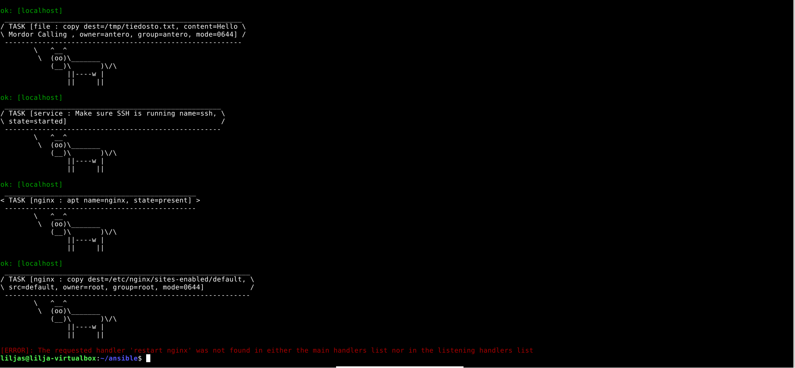

_Handlers puuttui_

Tässä olisi voinut toki katsoa välissä Karvisen (2026) ohjeistusta.

### Virhetilanne: Handlerin puuttuminen

`handler` puuttui. Eli lähdin nyt luomaan `handlers` -hakemiston Nginx-roolin alle ja sinne `main.yml`, johon laitan `restart nginx handler`.

* **`mkdir roles/nginx/handlers`** - luodaan hakemisto handlers

* **`micro roles/nginx/handlers/main.yml`** luodaan sisältö tiedostolle

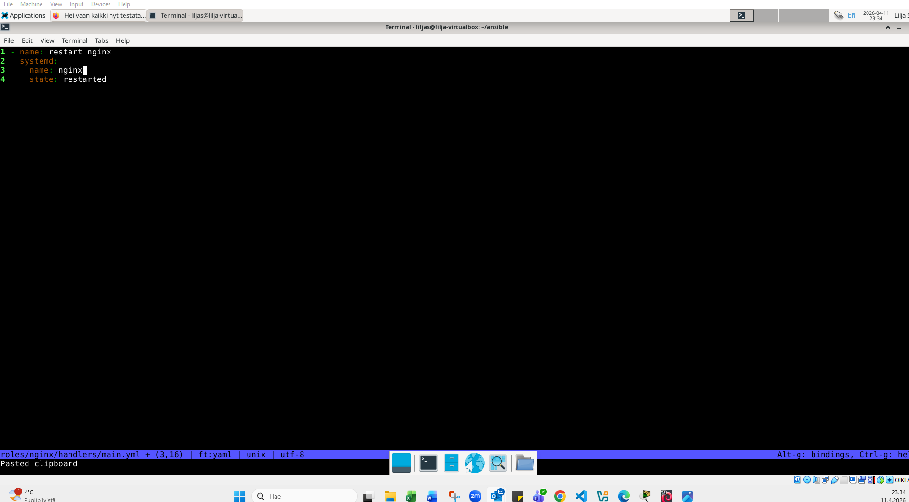

_Handlers sisältö_

Katsottu Karvisen (2026) handlers/main.yml -sisältö ohjeesta, mutta Apachen tilalle Nginx. 

Ja sitten vielä kolmas kerta toden sanoo ja Ansiblea potkaisemaan.

### Virhetilanne: Refusing to convert from file to symlink

Ja jälleen virhetilanne. Tässä kohtaa onneksi ei niin optimistisesti ollut liikenteessä, joten lähdin selvittämään mikä vikana.

Onneksi jälleen virheilmoitus sanoi selkeästi virheen. 

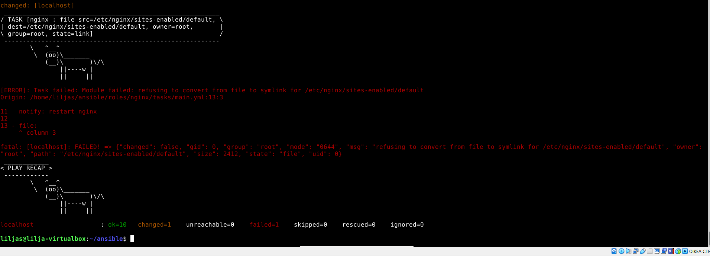

_Symlink herja_

Koitin tarkastella `ansible-doc file` - komennolla. Hetken tutkiskelun jälkeen selvisi että Ansible yritti luoda tämän normaalin filen tilalle symlinkin. 

Onneksi tähän löytyi lopulta oikea ja minulle selkeämpi ohjeistus Dhandalalta (2026), jossa kiteytettiin asia. 

Eli jos polku on normaalina tiedostona tai hakemistona (ei symlinkkinä), Ansible ei suostu ajamaan sitä oletuksena.

#### Poistetaan tavallinen tiedosto

* **`sudo rm /etc/nginx/sites-enabled/default`** - poistetaan tavallinen tiedosto

* **`ansible-playbook site.yml -k -K`** - ajetaan jälleen playbook

Viimeisenä piti vielä muuttaa `main.yml` -tiedostosta Dhandalan (2026) ohjeistuksen kohdan Symlinks for Configuration Management mukaan:

#### copy kopioi tiedoston `sites-available` -kansioon jossa konfiguraatiot

* **dest: `/etc/nginx/sites-available/default`** - kopioidaan konfiguraatiotiedosto sites-available kansioon.

#### file luo symlinkin `sites-enabled` -kansioon ja osoittaa sites-available-tiedostoon - ottaen konfiguroinnin käyttöön.

* **`src: /etc/nginx/sites-available/default`**
 
* **`dest: /etc/nginx/sites-enabled/default`**

**Symlink luodaan siis sites-enabled -kansioon (dest) ja laitetaan osoittamaan sites-available -kansioon olevaan tiedostoon (src).**

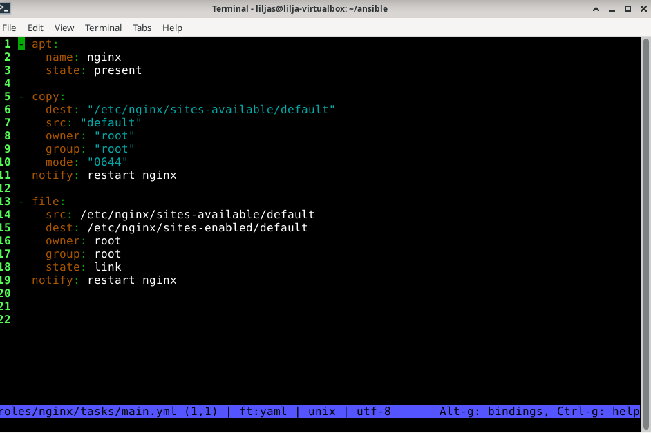

_Korjattu main.yml sisältö_

Tätä kohtaa oli hieman vaikeampi hahmottaa ja todennäköisesti se vaatii lisää treeniä. Sain kuitenkin lopulta hahmoteltua, että `main.yml`tiedostossa `dest` ja `src`, `file` ja `copy` osoittivat väärään polkuun.

Lopuksi vielä:

* **`ansible-playbook site.yml -k -K`** - ajetaan jälleen playbook

Se herjasi, etten olisi poistanut tavallista tiedostoa. Tein uudestaan onneksi tämän helpomman komennon 

* **`sudo rm /etc/nginx/sites-enabled/default`**

* **`ansible-playbook site.yml -k -K`** - ajetaan jälleen playbook

Ja vihdoin. Onnistuminen monen virheilmoituksen jälkeen.

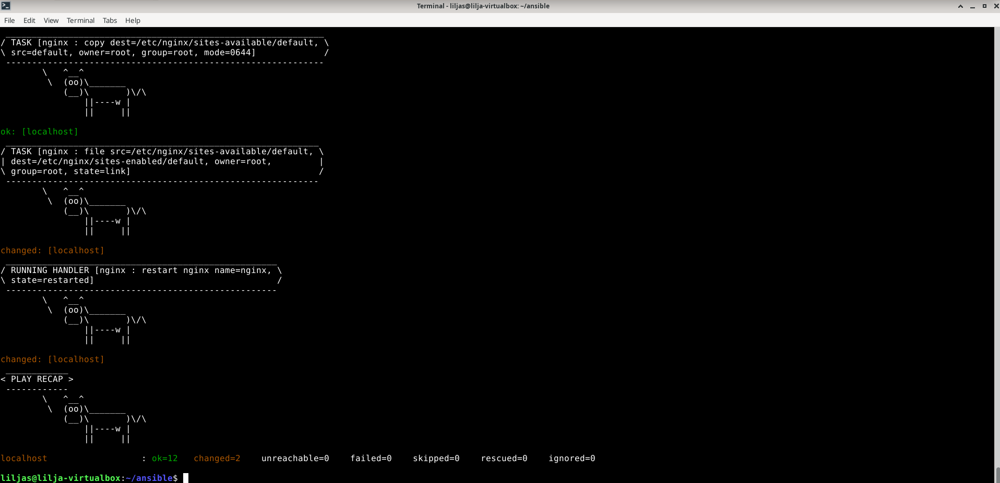

_Onnistuminen, ei enää virheilmoituksia_

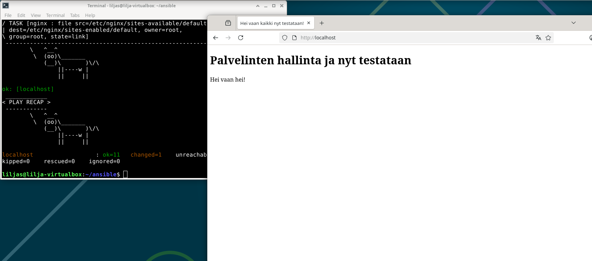

_Selaimen tarkistaminen ja localhost toimii_

## d) Vapaaehtoinen bonus

Lähdin tutustumaan tähän tehtävään. Tarkoituksena oli kokeilla IDS-projektia, Osiris T, jossa asennetaan:

* Suricata
 
* Wazuh Agent
  
* Wazuh Manager
 
* Wazuh Alerts Shipper
 
* Wazuh Indexer

Ensin alkuun tarkistin suositellun version ja (+30GB, +8GB RAM) levytilan. Ne olivat kunnossa, joten lähdin etenemään.

Latasin zip-tiedoston ja työkalun niiden purkuun.

* **`wget https://github.com/user-attachments/files/26421526/soc-project-v4.zip`** - zip-tiedosto
  
* **`sudo apt-get install zip`**  - työkalu zip-tiedostojen purkuun

* **`unzip soc-project-v4.zip`** - komento zip-tiedoston purkuun

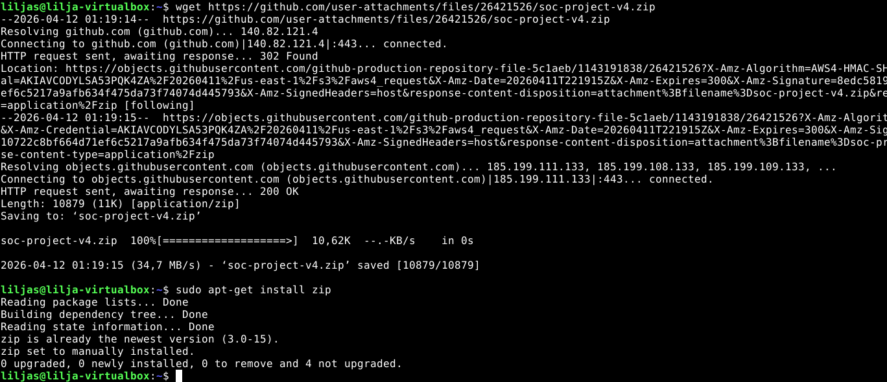

_zip-tiedoston ja purkutyökalun asenteluprosessia_

* **`cd soc-project`** - navigointi purettuun zip-tiedostoon `cd soc-project`
* **`ls`** tiedostojen listaukseen
* **`sudo bash install.sh`** - potkaisin käyntiin

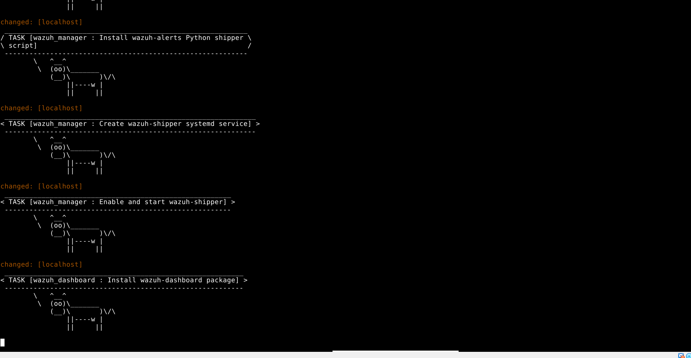

_Harjoitusympäristön latautumista_

Tässä kohdin jäin vain odottelemaan, sillä kahvin juonnille oli hieman liian myöhäistä.

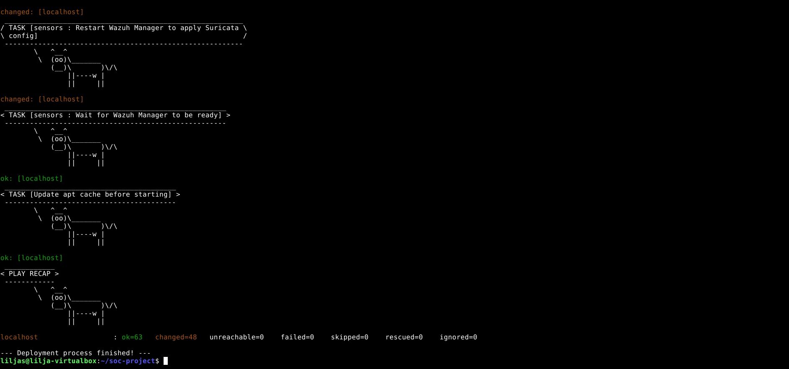

_Asennus oli valmis_

Seuraavaksi lähdin ohjeistuksen mukaisesti navigoimaan Firefoxilla `localhost` -sivulle.

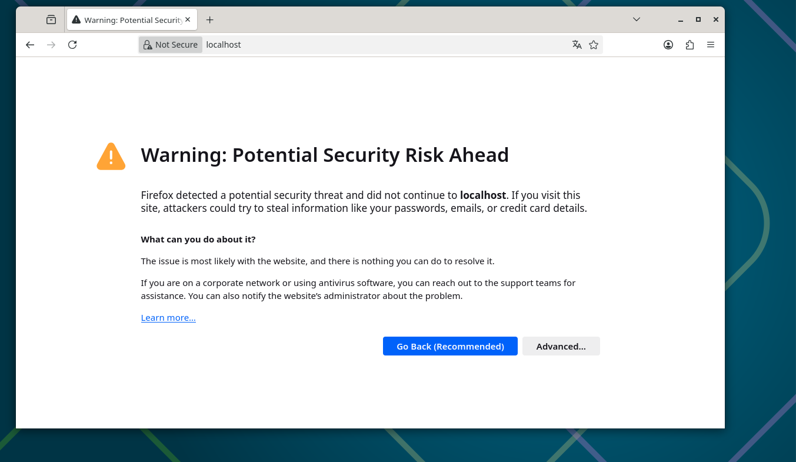

_Advanced kohdasta Accept the Risk and Continue_

#### Virheilmoitus

Laitoin käyttäjätunnuksen `admin` ja salasanan `admin`. Tuli kuitenkin alla oleva virheilmoitus:

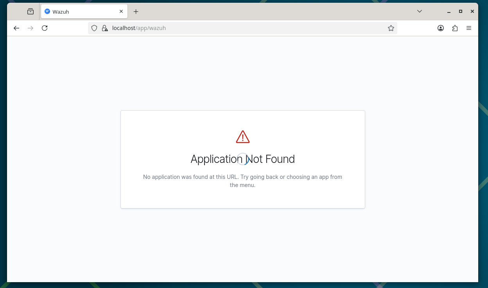

_Tulikin virheilmoitus_

* Osoitteeksi `localhost/app/home` ja **lähti toimimaan.**

Etenin Threat intelligence > Threat Hunting josta aukesi hälytykset:

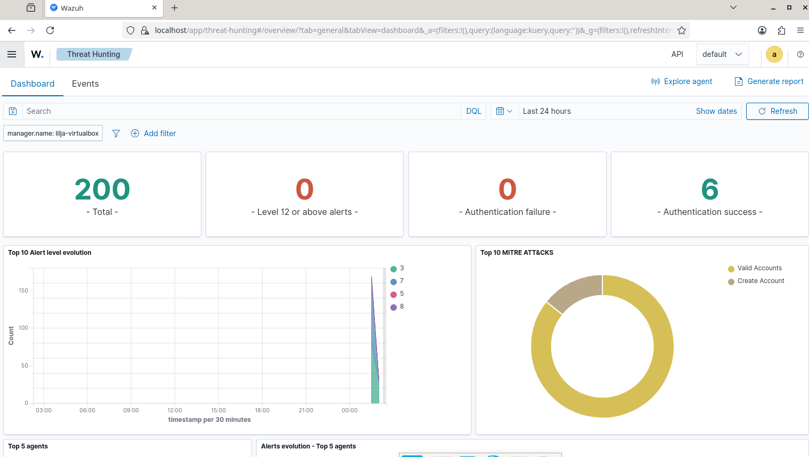

_Hälytykset_ 

Seuraavaksi katsoin, näkyykö liikennettä ja 200 näkyvissä kuten yllä kuvassa näkyy.

Lähdin ajamaan terminaaliin komennon:

* **`curl http://testmynids.org/uid/index.html`** ja lopuksi vielä refresh dashboardilla.

Nyt hälytyksiä oli jo ilmestynyt lisää dashboardille:

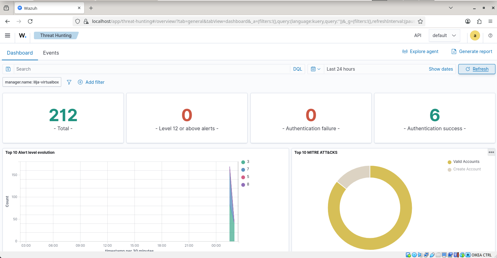

_Uusia hälytyksiä_

Kuten kuvassa näkyy, testaus oli onnistunut. Osiris-T toimi täydellisesti.

## Pohdinta

Alkutehtävät sujuivat erittäin helposti. Olisi hieman pitänyt aavistella, että tulee vielä vaikeampi osuus.

Tämä oli luennolla juuri se mitä harjoittelimme, että herjoja tulee vuoron perään ammattilaisellakin, ja niitä lähdetään vain yksitellen selvittämään.

Tehtävät olivat kuitenkin kaikin puolin todella opettavia. 

Uskon kyllä, että tarvitsen hieman treeniä tähän symlinkin asiaan, jossa pitää ymmärtää copy- ja file-tiedostojen järjestykset ja asetukset.

# Lähteet

Ansible Community Documentation. Dokumentti. Luettavissa: https://docs.ansible.com/projects/ansible/latest/collections/ansible/builtin/package_module.html/ Luettu: 11.04.2026.

Ansible Community Documentation. Dokumentti. _Handlers: running operations on change_ Luettavissa: https://docs.ansible.com/projects/ansible/latest/playbook_guide/playbooks_handlers.html/ Luettu: 11.04.2026.

Caleb, C. 2022. Video. Youtube. _File Ownership and Chown - Linux Tutorial 22_ Katsottavissa: https://www.youtube.com/watch?v=moNTR6zCLUc/ Katsottu: 11.04.2026.

Dhandala, N. 2026. Verkkosivu. _How to Create Symbolic Links with the Ansible file Module_ Luettavissa: https://oneuptime.com/blog/post/2026-02-21-how-to-create-symbolic-links-with-the-ansible-file-module/view/ Luettu: 11.04.2026.

Häkämies, Saario, Mukkula 2026: Osiris-T. Luettavissa: https://github.com/oskarihakamies/IDS-project/blob/main/How-To-Install.md/ Luettu: 11.04.2026.

Karvinen, T.2026. Verkkosivu. _Apache installed with Ansible - quick notes_ Luettavissa: https://terokarvinen.com/apache-ansible/ Luettu: 11.04.2026.

Karvinen, T. 2020. Verkkosivu. _Command Line Basics Revisited_ Luettavissa: https://terokarvinen.com/2020/command-line-basics-revisited/ Luettu: 05.04.2026.

Karvinen, T. 2008. Verkkosivu. _Install Apache Web Server on Ubuntu_ Luettavissa: https://terokarvinen.com/2008/05/02/install-apache-web-server-on-ubuntu-4/index.html/ Luettu: 15.10.2025.

Lehto, S. 2022. Verkkosivu. _Apache Weppipalvelin_. Luettavissa: https://susannalehto.fi/2022/apache-weppipalvelin-h3/ Luettu: 11.04.2026.

Sharifi, L. 2026. Verkkosivu. _h2 Voileipä_ Luettavissa: https://github.com/LilJayyy/Palvelinten-hallinta/blob/main/h2%20Voileip%C3%A4.md/ Luettu: 11.04.2026.

Travis Media. 2024. Video. Youtube. _Linux File Permissions in 5 Minutes | MUST Know!_ Katsottavissa: https://www.youtube.com/watch?v=LnKoncbQBsM/ Katsottu: 11.04.2026.

Panovski, D. 2026. Verkkosivu. _chown Command in Linux: Change File Ownership_ Luettavissa: https://linuxize.com/post/linux-chown-command/ Luettu: 11.04.2026.

