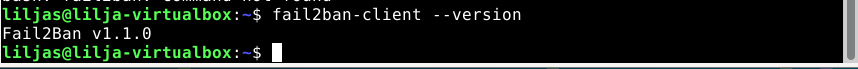
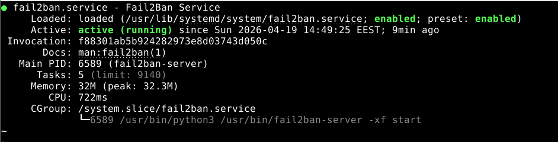
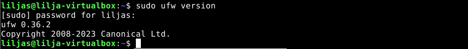
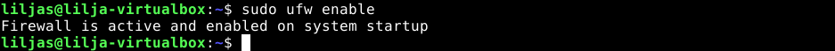
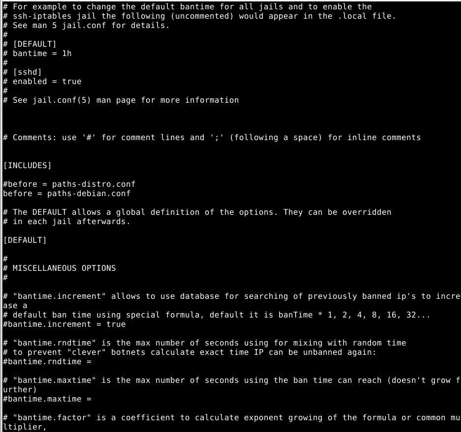

# h3 Pizza Fantasia
 
# Sisältö
* [x) Artikkeli](#x-artikkeli)
* [a) Räpylä](#a-apassi)
* [b) Automaatti](#b-moottorix)
* [c) Asetus](#c-automoottorix)
* [d) Paikka remonttiin](#d-paikka-remonttin)
* [e) Idempotentti](#e-idempotentti)


### Koneen tekniset tiedot
* Prosessori: Intel Core i5-8265U CPU @ 1.60 GHz (1.80 GHz turbo, 8 ydintä)
* RAM: 16 GB (15,7 GB käytettävissä)
* Järjestelmä: Windows 11 Pro 64-bittinen (x64-suoritin)
* Näytönohjain: Intel UHD Graphics 620
* Tallennustila: 237 GB, josta 158 GB vapaana
* DirectX-versio: DirectX 12

Vinkit

CM: configuration management
DSL: domain specific language. Yhteen käyttötarkoitukseen tehty kieli. Esim Ansiblen oma kieli, jolla määrittelemme konfiguraatiota.
Kannattaa valita demoni, joka löytyy suoraan Debian 13 varastoista apt-get:lla.
Esimerkkejä: postgresql, caddy, mariadb, haproxy, varnish
Nämä voivat olla mutkikkaampia: samba, nfs, jokin ftp-palvelin, jokin vaihtoehtoinen ssh, jokin dhcpd, jokin tftpd


## x) Artikkeli

### Karvinen 2023: Configuration Management of Distributed Systems over Unreliable and Hostile Networks

#### 4.12.1 Size and Complexity of Some DSLs (112. Ominaisuuksien määrä.)
- DSL-kielet voivat olla monimutkaisia ja laajoja. Karvinen analysoi johtavien konfiguraatiotyökalujen Saltin sekä Puppetin monimutkaisuutta.
- Analysoinnissa Karvinen käytti ja tutki automaattisesti generoituja manuaaleja lähdekoodista.
- Saltilla oli 510 toimintoa, 20 000 riviä dokumentaatiota ja yli 75 000 sanaa. Puppetilla on 113 toimintoa ja se käyttää omia erikoiskäsitteitä ja ohjausrakenteita, toisin kuin perinteisimmät ohjelmointikielet, kuten C, Go tai Python.
- Kysymys: Arvioiko juuri manuaalin koko monimutkaisuutta?

#### 4.12.2 Use of DSL Functions in Case Configuration (112-115. Mitä oikeasti käytetään.)
- Tutkimuksen laajuuden analysointia varten valikoitui United States Government Configuration baseline (NIST,2016) ja Mozilla Release Engineering Puppet Manifests (Mitchell et al., 2020).
- Pieni joukko komentoja kattaa 87% kaikista komennoista ja ohjausrakenteista. Yleisimpinä myös alla mainitut `file`, `package`, `exec` ja `service`.
- Kommentti: Miksi tehdä vaikeasti, kun voi tehdä yksinkertaisesti?


#### 4.12.3.1 Dependencies Between Main Functions (115-117. Tärkeimmät rakennuspalikat.)
- Muutama komento kattaa suurimman osan konfiguraatioista.
- Tärkeimmät perustoiminnot ovat kaiken perusta: `exec`, joka kutsuu muita ohjelmistoja, ja `file` tiedostojen hallintaan joiden pohjalle yllä olevat funktiot rakentuvat
- Kommentti: Miksi sitten muita komentoja on niin paljon, jos tarvitaan vain perustoiminnot?


## a) Räpylä

Lähdin tekemään raporttiosiota 19.4. kello 14.20. Meni hetki valita mieluinen demoni.

## fail2ban

#### Mikä se on? 

Päätin asentaa fail2banin, eli tunkeutumisen estoon kehitetty järjestelmä, joka suojelee Linux-servereitä automaattisilta hyökkäyksiltä.  

Työkalu toimii _jailsien_, eli vankiloiden, avulla. Näitä kutsutaan valvontasäännöiksi tietyille palveluille. 

Sitä voidaan ajatella eräänlaisena vartijana, joka tutkii ja tarkistelee palvelimen lokitietoja kellon ympäri ja tutkii merkkejä haitallisesta toiminnasta, kuten epäonnistuneet kirjautumisyritykset, toistuvat yritykset, skannausyritykset, salasanan arvaukset ja niin edelleen. 

Epäilyttävän toiminnan havaittuaan se estää automaattisesti hyökkääjän IP-osoitteen lisäämällä palomuuriin uusia sääntöjä estäen pääsyn tietyksi määräajaksi.

Löysin tähän erittäin selkeän ohjeen (James, J.) ja lähdin etenemään seuraavin askelin.


### Asennetaan Fail2Ban ja tarkistetaan asennuksen onnistuminen

Ennen asennusta tehdään tärkein asia: Päivitetään paketit.

* **`sudo apt-get update`** - päivitetään paketit eli pakettilistat

* **`sudo apt install fail2ban`** - asennetaan fail2ban

* **`fail2ban-client --version`** - katsotaan että asennus on onnistunut tarkistamalla versio

* **`apt-cache policy fail2ban`** - paketin lähde kertoo asennusversion ja repositorion (varasto) lähteen

````
fail2ban:
  Installed: 1.1.0-8
  Candidate: 1.1.0-8
  Version table:
 *** 1.1.0-8 500
        500 http://deb.debian.org/debian trixie/main amd64 Packages
        100 /var/lib/dpkg/status
````



_Asennus onnistunut ja versio 1.1.0_


### Tarkistetaan Fail2Banin status eli onko aktiivinen

* **`systemctl status fail2ban`** -tarkistetaan tila eli status



_enabled ja active eli käynnissä jo_

Fail2Ban käynnistyy automaattisesti eikä tässä kohtaa ollut ongelmia, eli se oli käynnissä. 

#### Jos ei olisi ollut käynnissä etenisit seuraavasti:

* **`sudo systemctl enable --now fail2ban`** - komento pakottaa käynnistämään ja pitää käynnissä boottauksen jälkeen.

### UFW asentaminen 

Tässä kohtaa pystyin skippaamaan, sillä minulla oli jo UFW asennettuna. 

Debian 13 käyttää oletuksena nftables-palomuuria, joka toimii fail2banin kanssa automaattisesti.

UFW on vaihtoehtoinen, ei pakollinen, sillä fail2ban itsessään tukee useita palomuuritaustajärjestelmiä.

#### Jos UFW:tä ei ole ja halutaan asentaa:

* **`sudo apt install ufw`** - asennetaan UFW eli Uncomplicated Firewall palomuuri

* **`ufw version tai sudo ufw version`** - tarkistetaan versio jälleen eli onnistuiko asentaminen 



_ufw versio eli onnistunut asennus_

### Enabloidaan eli otetaan käyttöön UFW

Palomuuri aktivoitiin ja varmistettiin, että se alkaa automaattisesti, kun Debian-palvelin käynnistyy. 

On tärkeää muistaa, että jos olet kirjautunut SSH-yhteydellä, palomuurin tulee antaa oikeudet OpenSSH:lle. 

* **`sudo ufw allow OpenSSH`** - annetaan lupa SSH-yhteydelle - Olin suoraan konsoliyhteydellä, joten tämä oli itselleni tarpeeton.

* **`sudo ufw enable`** - laitetaan palomuuri päälle

Seuraavaksi tuli ilmoitus:



_Palomuuri oli päällä_

Fail2Ban oli nyt asennettu ja UFW-palomuuri otettu käyttöön.

### Varmuuskopio Fail2Banin konfiguraatiotiedostoille

Fail2Banin asennuksessa tulee kaksi oletuskonfiguraatiotiedostoa: 

`/etc/fail2ban/jail.conf` ja `/etc/fail2ban/jail.d/defaults-debian.conf`.

Lähdin luomaan Fail2Banin konfiguraatiotiedostoille varmuuskopiota, jotta tekemäni muutokset päivittyvät pakettipäivitysten aikana.

Oli tärkeää ymmärtää, ettei `default.conf` -oletustiedostoja muuteta suoraan. 

Kopiot konfiguraatiotiedostoista luotiin `.local` -päätteellä, jotta omat muutokset säilyisivät. 

Fail2Ban lukee `.local` -tiedostoja oletuksena ennen `.conf` -tiedostoja, joten siksi muutokseni tehtiin sinne.

### Luodaan jail.local-tiedosto ja kopioidaan konfiguraatiotiedoston sisältö sinne

* **`sudo cp /etc/fail2ban/jail.conf /etc/fail2ban/jail.local`** - kopioidaan sudona `cp` komennolla konfiguraatiotiedoston sisältö jail.localiin

* **`ls /etc/fail2ban`** -  tarkistetaan fail2ban-hakemistosta, kopioituiko sisältö onnistuneesti.
  
* **`cat /etc/fail2ban/jail.local`** - hakemistosta katsotaan cat-komennolla tiedoston sisään



_Konfiguraatiotiedoston sisältö onnistuneesti jail.local -tiedostossa_


## b) Automaatti
Automaatti. Automatisoi valitsemasi demonin asennus Ansiblella.


## c) Asetus
Muuta asetustiedostoa herralla (master, "control node") ja aja ansible uudestaan. Osoita, että asetukset tulivat käyttöön.

## d) Paikka remonttiin
Riko jotain asetuksia. Voit esimerkiksi poistaa demonin 'sudo apt-get purge foobar' (purge poistaa myös asetustiedostoja), poistaa asennuksen yhteydessä tulevan kansion (sudo rm -r /etc/foobar/ # vaarallista) tms. Ja sitten ajaa ansible-roolisi uudestaan ja todeta, että se korjaa tilanteen.

## e) Idempotentti
Osoita, että tilasi on idempotentti.


## Lähteet 

Karvinen, T. 2024. Opinnäytetyö. _Configuration Management of Distributed Systems over Unreliable and Hostile Networks._ Luettavissa: https://westminsterresearch.westminster.ac.uk/item/w7vvz/configuration-management-of-distributed-systems-over-unreliable-and-hostile-networks/ Luettu: 19.4.2026.

Dhandala, N. 2026. Verkkosivu. _How to Use Ansible local Connection Plugin_ Luettavissa: https://oneuptime.com/blog/post/2026-02-21-how-to-use-ansible-local-connection-plugin/view/ Luettu: 19.4.2026

James, J. Verkkosivu. _How to Install Fail2Ban on Debian (13, 12, 11)_ Luettavissa: https://linuxcapable.com/how-to-install-fail2ban-on-debian-linux/ Luettu: 19.4.2026.
