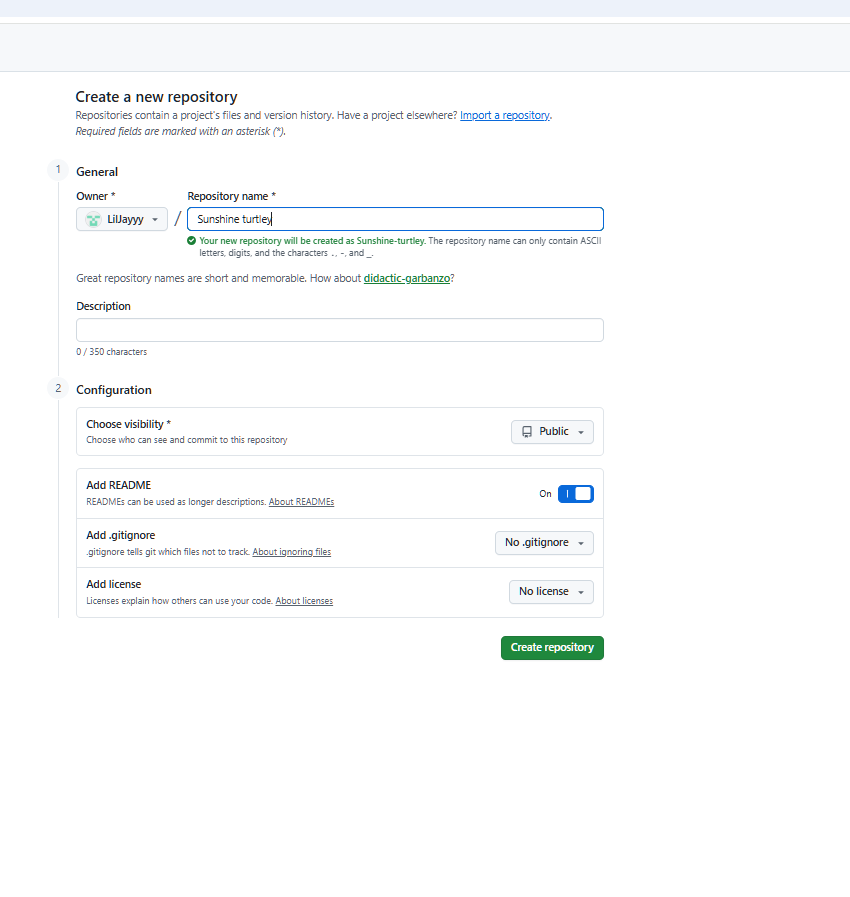
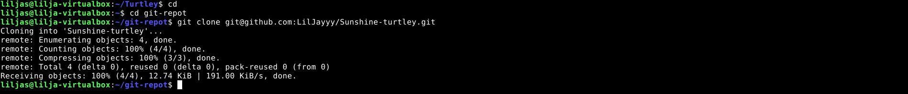
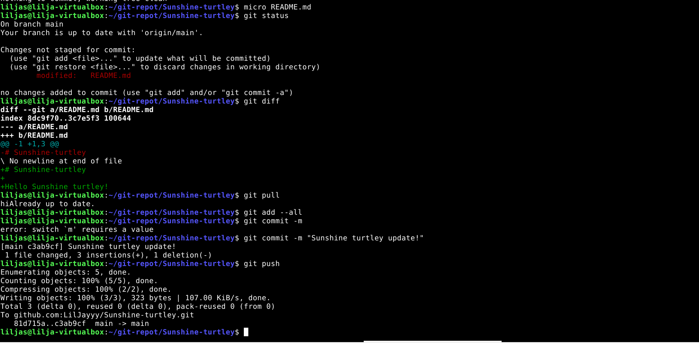
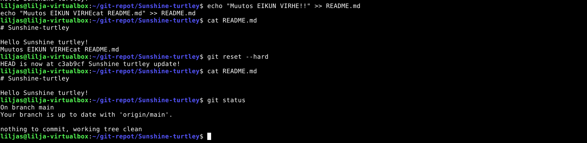
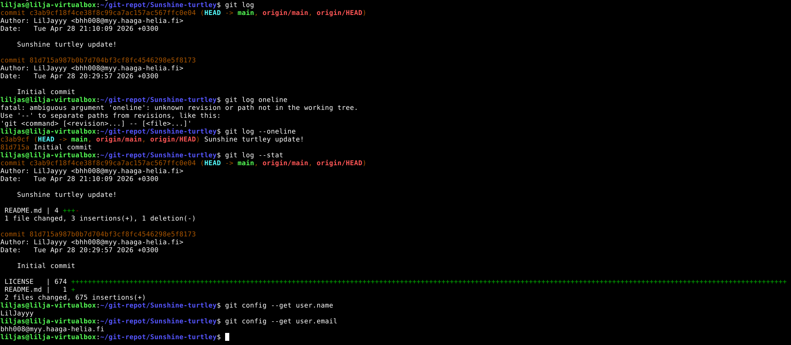
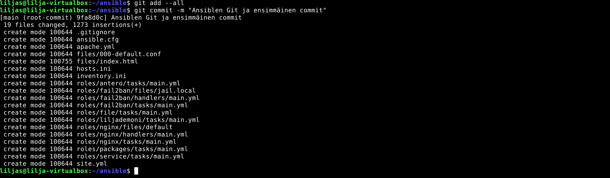
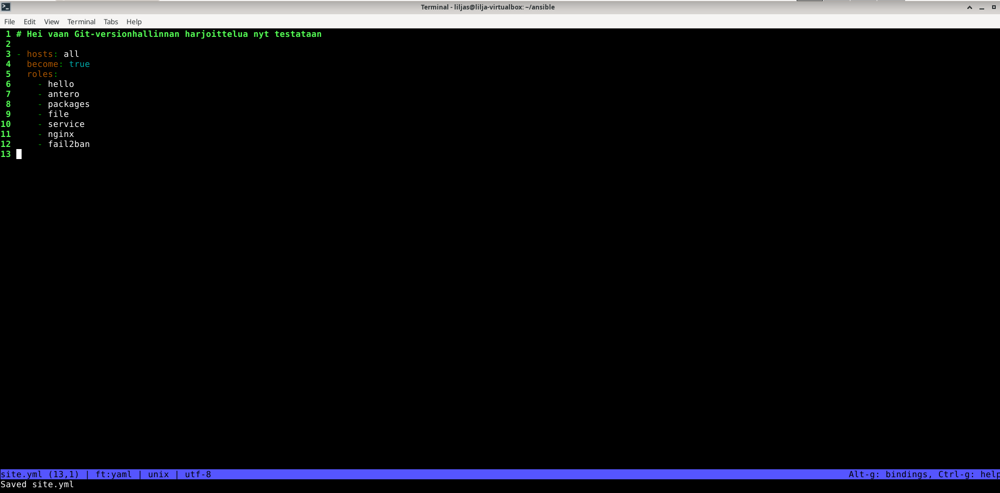
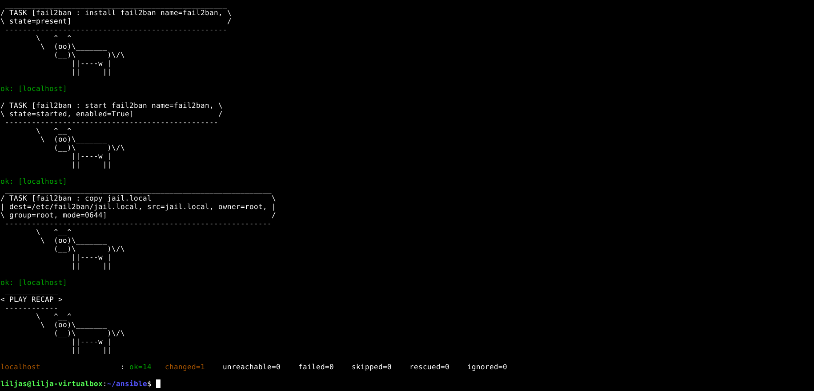
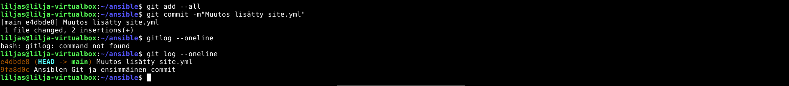

* [x) Artikkeli](#x-artikkeli)
* [a) Online ](#a-online)
* [b) Dolly](#b-dolly)
* [c) Doh!](#c-doh!)
* [d) Tukki](#d-tukki)
* [e) Gitanbile](#e-gitanbile)
* [f) Hae pari projektiin](#f-hae-pari-projektiin)

### Koneen tekniset tiedot
* Prosessori: Intel Core i5-8265U CPU @ 1.60 GHz (1.80 GHz turbo, 8 ydintä)
* RAM: 16 GB (15,7 GB käytettävissä)
* Järjestelmä: Windows 11 Pro 64-bittinen (x64-suoritin)
* Näytönohjain: Intel UHD Graphics 620
* Tallennustila: 237 GB, josta 158 GB vapaana
* DirectX-versio: DirectX 12

# x) Artikkeli

#### What is Git?
- Versionhallintajärjestelmä, joka ottaa valokuvia projektin jokaisesta vaiheesta commitilla.
 
- Muutokset ja sisältö luodaan paikallisesti omalta koneelta, ja ne siirtyvät etäpalvelimelle, kun on suoritettu push-komento eli `git push`. Aina ennen tätä on suositeltavaa suorittaa komento `git pull`.

#### 'git add --all && git commit; git pull && git push'.

* **`&&`** -  shell-operaattori joka ajaa ehtona vain jos edellinen onnistunut. `;` ajaa vaikka ei olisikaan onnistunut
 
* **`git add`** -komento siirtää työhakemistosta staging-alueelle muutokset snapshotin ottamista varten. 

* **`git commit`** - komento ottaa snapshotin eli valokuvan projektin Git-tietokantaan.
  
* **`git pull`** - komento on automatisoitu versio fetch-komennosta. Haara ladataan etärepositorysta ja yhdistetään eli "mergataan" se nykyiseen haaraan Git-tietokantaan.

* **`git push`** -komento lähettää muutokset etäpalvelimelle eli siirtää paikallisen haarakkeen toiseen repositoryyn jossa se julkaistaan.

# a) Online.

Lähdin kirjoittamaan raporttia 28.4.2026 kello 20:35.

Alkuun loin repositoryn eli varaston:

1. Kirjauduin: www.github.com
2. Loin uuden varaston oikeasta yläkulmasta `+` ja new repository. Julkinen ja "Add readme" valittuna.
3. Add a license ja sieltä `GNU General Public License v3.0`
4. Lopuksi vielä "Create" -painikkeesta.

_Varasto (repository) luotu onnistuneesti "Sunshine" sanalla_

# b) Dolly

Seuraavaan tehtävän osioon etenin 20:38. 

Oli tarkoitus kloonata äsken luotu varasto eli repository, tehdä siihen muutoksia ja puskea muutokset palvelimelle ja katsoa onnistunut lopputulos

## Kloonataan varasto 

* HTTPS linkin kopiointia klikkaamalla repositoryn vihreästä "Code" -painikkeesta
 
* **`cd`** - kotihakemistoon
  
* **`mkdir -p git-repot`** - luodaan kansio
 
* **`cd git-repot`** - siirrytään kansioon

* **`git clone git@github.com:LilJayyy/Sunshine-turtley.git`** - kloonataan varasto

_Onnistunut kansion luominen ja varaston kloonaus_

## Muutos luotuun varastoon

* **`cd sunshine-turtley`** - siirrytään repoon
 
* **`micro README.md`** -  muokataan microlla varaston eli repon sisältö

* **`ctrl + S ja ctrl + Q`** - tallennetaan muutokset

* **`git status`** - tarkistetaan tila 

* **`git diff`** - muutoksien erot

* **`git add --all`** - lisätään

* **`git commit -m "Sunshine turtley update!"`** - commit ja mitä tehty

* **`git pull`** - etäpalvelimesta muutosten hakeminen haaraan

* **`git push`** - pushataan eli lähetetään muutokset etäpalvelimelle

_Sisällön muutos ja muutosten lähettäminen etäpalvelimelle_ 

# c) Doh!

Tähän tehtävänosioon lähdin 21:18. Tämän tehtäväosion tarkoituksena oli tehdä muutos ja kumota se.

## Lähdetään tekemään muutos README.md tiedostoon

Tässä kohtaa piti olla tarkkana, sillä kaikki ei-commitatut muutokset poistuvat eikä muutosta voi perua.

* **`echo "Muutos EIKUN virhe!!" >> README.md`**

## Poistetaan tehty muutos

* **`git reset --hard`** - resetoidaan tehty muutos

* **`cat README.md`** - tarkistetaan poistuiko se

_Onnistunut muutos ja muutoksen kumoaminen_ 

# d) Tukki

Tähän tehtävänosioon siirryin 21:25. Tarkoitukseni oli tarkastella varastoni lokitiedostoja.

Tehtävässä käytin apuna tehtävänannon osiota (Karvinen, 2026) sekä Atlassianin ohjesivua.

## Avataan lokitiedostot tarkistelua varten

* **`git log`** - avataan varaston lokitiedostot tarkastelua varten

* **`git log --oneline`** - lyhennetään eli tiivistellään loki näkymää yhteen riviin

* **`git log --stat`** - tarkistetaan tilastot joita muutettu tiedostoissa commiteissa ja rivimuutokset

* **`git config --get user.name` ja `git config --get user.email`** - tarkistetaan käyttäjän nimi ja sähköpostiosoite, tätä kokeilimmekin  luennon aikana.

* **`git log -p`** - tarkistetaan tällä tiedostojen muutokset

## Lokitiedostojen tulkinta

Alla olevasta kuvasta pystyin havaita, että minulla oli:

* Kaksi committia

* Initial committissä lisätty 675 riviä (License 674 + README 1)

* Nimeni ja sähköpostiosoitteeni olivat oikein ja minun haluamallani tavalla näkyvissä.

_Lokitiedostot_ 

# e) Gitanbile

Tähän tehtävänosioon siirryin 22:03 tutkittuani hieman aihetta.

Tarkoituksena oli laittaa Ansible-kansio versionhallintaan. 

Piti tehdä muutos, ajaa se ansiblella ja tallentaa versio `commit`:lla.

Käytin tässä apuna tovin etsimisen jälkeen erinomaisen ohjeen Subbiahilta (2024).

## Ansible kansio versionhallintaan

* **`cd ansible`** - siirryin Ansibleen

* **`git init`** - initialize eli "init" jolla **alustin** versionhallinnan kansioon
-Tämän komennon hahmottamisessa meni hetki, mutta käytännössä se luo .git/kansion ja kokonaisuuden, jolla Git alkaa toimimaan seuraamalla muutoksia.

* **`git add --all`** - staging -alueelle lisätään tiedostot

* **`git commit -m "Ansiblen Git ja ensimmäinen commit"`** - snapshotin tallennus ja commit-viesti

* **`git log --oneline`** - tiivistetty lokinäkymä yhden rivin tarkkuudella, tarkistin onnistumisen

Ajattelin tämän tehtävänosion olevan haasteellisempi. Lähinnä meni aikaa hahmottaessa, mitä lähden tekemään.

Asia lähti luistamaan, kun oikea ohjeistus löytyi ja kerkesin pohtia hetken.

_Lokinäkymässä Ansible-kansion alustus ja ensimmäinen commit_ 

## Tiedoston sisällön muuttaminen

* **`micro site.yml`** - muutin olemassa olevan tiedoston sisältöä eli avasin micron

Lisäsin alkuun alla olevan tekstin testinä:

_site.yml tiedostoon muutos testinä_

Lopuksi vielä tallennus

## Ajetaan ansible testiksi

* **`sudo ansible-playbook site.yml`** - ajetaan ansiblella

_Miellyttävä lopputulos, playbook on ajettu täydellisesti_ 

## Tallennetaan muutokset eli commit 

* **`git add --all`** - Staging-alueelle tiedostojen lisäys

* **`git commit -m "Muutos lisätty site.yml"`** - commit ja viesti

* **`git log --oneline`** - tarkistus lokitiedoista onnistuiko muutos

_Commit eli tallennus onnistui_

Tässä kohtaa kello olikin jo 23:09 harmikseni jää vapaaehtoiset tehtävät tällä kertaa tekemättä.

# f) Hae pari projektiin

Pari on hankittu.

## Lähteet 

Ansible Docs. Dokumentti. _Connection methods and details._ Luettavissa: https://docs.ansible.com/projects/ansible/latest/inventory_guide/connection_details.html/ Luettu: 28.4.2026

Ansible Docs. Dokumentti. _Handlers: running operations on change._ Luettavissa: https://docs.ansible.com/projects/ansible/latest/playbook_guide/playbooks_handlers.html/ Luettu: 28.4.2026

Ansible Docs. Dokumentti. _Getting started._ Luettavissa: https://docs.ansible.com/projects/ansible/latest/getting_started/get_started_playbook.html/ Luettu: 28.4.2026.

Atlassian. Verkkosivu. _Git Glossary_ Luettavissa: https://www.atlassian.com/git/glossary/ Luettu: 28.4.2026.

Atlassian. Verkkosivu. _Inspecting a repository._ Luettavissa: https://www.atlassian.com/git/tutorials/inspecting-a-repository#git-log/  Luettu: 28.4.2026.

Chacon and Straub 2014: _Pro Git, 2ed: 1.3 Getting Started - What is Git?._ Luettavissa: https://git-scm.com/book/en/v2/Getting-Started-What-is-Git%3F/ Luettu: 28.4.2026.

Karvinen, T. 2026. Verkkosivu. _Apache installed with Ansible - quick notes._ Luettavissa: https://terokarvinen.com/apache-ansible/ Luettu: 28.4.2026.

Karvinen, T. 2020. Verkkosivu. _Command Line Basics Revisited._ Luettavissa: https://terokarvinen.com/2020/command-line-basics-revisited/ Luettu: 28.4.2026.

Subbiah, V. 2024. Day 22: _Integrating Ansible with Version Control Systems._ Luettavissa: https://medium.com/@vinoji2005/day-22-integrating-ansible-with-version-control-systems-57f47d635a95/ Luettu: 28.4.2026.

Redhat. _Introduction to Git and GitHub._ Verkkosivu. Luettavissa: https://developers.redhat.com/learning/learn:ansible:foundations-ansible/resource/resources:introduction-git-and-github/ Luettu: 28.4.2026.

Swiftorial. Verkkosivu. _Using Git with Ansible._ Luettavissa: https://www.swiftorial.com/tutorials/devops/ansible/version_control/using_git_with_ansible/ Luettu: 28.4.2026.

Sharifi, L. 2026. Verkkosivu. _h2 Voileipä._ Luettavissa: https://github.com/LilJayyy/Palvelinten-hallinta/blob/main/h2%20Voileip%C3%A4.md/ Luettu: 28.4.2026.

Sharifi, L. 2026. Verkkosivu. _h3 Demoni._ Luettavissa: https://github.com/LilJayyy/Palvelinten-hallinta/blob/main/h3%20Demoni.md/ Luettu 28.04.2026.
